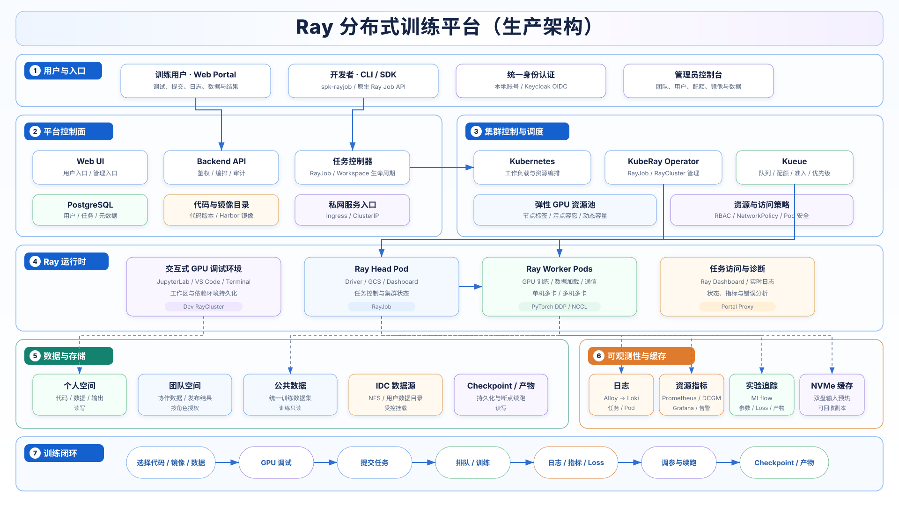

# Ray 分布式训练平台

面向算法工程师与平台管理员的多租户 GPU 训练基础设施。用户通过 Web Portal、`spk-rayjob` 或原生 Ray Jobs API 提交代码；平台负责身份鉴权、数据挂载、GPU 配额、排队、RayCluster 生命周期、日志指标与训练产物。

训练代码随任务上传，镜像只提供固定的 CUDA、PyTorch、Ray 和系统依赖。修改 Python 或配置文件后可以直接重新提交，不需要为每次代码变更重建镜像。



## 平台解决什么问题

一条训练任务从提交到结束会经过同一条受控链路：

```text
选择代码、镜像和数据
        ↓
交互式 GPU 调试
        ↓
Portal / spk-rayjob / Ray Jobs API
        ↓
身份、租户配额与 Kueue 准入
        ↓
KubeRay 创建任务专属 RayCluster
        ↓
单机多卡或多机多卡训练
        ↓
日志、GPU 指标、Loss、Checkpoint 与训练产物
```

平台用户不需要 Kubernetes kubeconfig，也不接触对象存储 AK/SK。Kubernetes、TOS/CSI、镜像仓库和监控系统由平台控制面统一管理。

## 核心能力

| 能力 | 当前实现 |
| --- | --- |
| 任务提交 | Web Portal、`spk-rayjob`、原生 Ray Jobs API；三种入口统一进入平台任务记录。 |
| 分布式训练 | KubeRay 管理 RayJob/RayCluster；支持单卡、单机多卡和多机多卡 PyTorch DDP/NCCL。 |
| 调度与配额 | Kueue 负责队列和准入；平台按 Ready GPU 节点动态计算物理容量，团队配额由管理员单独分配。 |
| 交互式调试 | JupyterLab、VS Code、Terminal 连接 GPU Worker；工作区、个人数据和 Python 虚拟环境持久化。 |
| 数据治理 | 公共数据、团队数据、个人数据与结果使用稳定逻辑路径；训练 Pod 不持有对象存储长期凭据。 |
| 代码与镜像 | 代码通过 working-dir、工作区快照或固定 Git commit 提交；训练镜像按不可变 digest 登记。 |
| 可观测性 | Loki/Alloy 提供任务日志，Prometheus Operator/DCGM 提供 GPU 和集群指标，Grafana 提供仪表盘；平台实验中心提供受身份过滤的 MLflow 视图，原生 MLflow 提供完整管理界面。 |
| 训练诊断 | 任务状态、排队时间、运行时间、Pod 日志流、Ray Dashboard 和 GPU 使用率统一关联到平台任务 ID；受管入口还自动关联训练产物。 |
| 断点续训 | Checkpoint 写入个人结果空间；新任务可把历史任务结果只读挂载后显式 resume。 |
| 多租户管理 | 用户、角色、租户、团队 GPU 配额、镜像、Git 凭据和数据发布均由管理员页面管理。 |

## 架构组成

平台分为六个边界清晰的层：

1. **用户与入口**：Web Portal、CLI/SDK、本地账号与可选的 Keycloak OIDC。
2. **平台控制面**：Vue 前端、Go API、任务控制器、PostgreSQL 元数据和 CLI 发布服务。
3. **集群控制与调度**：Kubernetes、KubeRay、Kueue、RBAC、NetworkPolicy 和 GPU 节点选择策略。
4. **Ray 运行时**：调试环境使用 Dev RayCluster；批量训练为任务专属 Ray head 与 GPU worker。
5. **数据与存储**：个人、团队、公共、IDC 数据源以及 Checkpoint/产物；对象存储是数据真相。
6. **可观测性**：日志、指标、GPU 遥测、持久 MLflow 实验中心与原生管理界面、运行期 Ray Dashboard 和可选的节点本地临时缓存。

完整网络边界、资源所有权、数据契约和高可用说明见[生产架构](docs/ARCHITECTURE.md)。

## 数据目录契约

用户代码只依赖稳定容器路径，不依赖桶名、PVC 名或节点目录：

| 路径 | 权限 | 用途 |
| --- | --- | --- |
| `/workspace` | 读写 | 调试代码、配置、编辑器状态和用户虚拟环境。 |
| `/mnt/storage/me` | 读写 | 个人文件、训练结果和 Checkpoint。 |
| `/mnt/storage/team` | Pod 内只读 | 团队发布的数据集。TenantAdmin 可通过 Portal 发布内容。 |
| `/mnt/storage/public` | Pod 内只读 | 平台管理员发布的公共训练数据。 |
| `/mnt/idc/*` | 按登记策略只读 | 可选 IDC NFS 数据源。 |

训练入口会进一步注入：

```text
PLATFORM_DATASET_PATH     本任务选中的只读输入目录
PLATFORM_OUTPUT_PATH      本任务独立的个人结果目录
PLATFORM_CHECKPOINT_PATH  续训时挂载的历史结果目录（可选）
```

推荐训练代码优先读取这些环境变量；用户也可以在调试环境中直接浏览上述稳定路径。详细示例见[用户手册](docs/USER_GUIDE.md)和[新训练代码接入手册](docs/NEW_TRAINING_CODE_GUIDE.md)。

公共数据的唯一对象存储根是 `tos://shanghai-data-transfer/ray-train/public/`，在容器内映射为 `/mnt/storage/public`。当前全量原始数据主要发布在 `/mnt/storage/public/labeled/`，训练索引和版本化样例位于公共根的其他子目录。提交任务时选择某个子目录后，`PLATFORM_DATASET_PATH` 就指向该子目录；训练代码中的路径必须相对于这个选择结果，不能再重复拼接公共根或所选目录名。

## 三种提交入口

| 入口 | 适用场景 | 代码如何进入集群 |
| --- | --- | --- |
| Web Portal | 初次使用、需要目录选择和可视化配置 | 调试工作区快照或固定 Git commit。 |
| `spk-rayjob` | 用户在电脑、服务器或集群外 GPU 节点频繁修改代码 | 每次提交自动打包当前 working directory。 |
| 原生 Ray Jobs API | 已有 Ray 自动化或 SDK 集成 | `ray job submit --working-dir .` 上传当前代码。 |

每个任务都会自动创建独立 RayCluster。用户不需要编写 RayCluster YAML；任务进入终态后，RayCluster 按保留窗口回收，历史日志和状态继续从平台查看。Portal 与 `spk-rayjob` 自动把 checkpoint/产物绑定到任务；原生 Ray CLI 手工输出仍保存在个人目录，但不自动获得任务产物浏览和一键续训。

完整命令、参数和 BEVFusion 示例见[多方式提交手册](docs/SUBMIT_GUIDE.md)。

## 已验证基线

当前交付基线已在真实双节点 GPU 资源池完成以下验证：

- 两个 BEVFusion 分支分别通过 Web Portal、`spk-rayjob` 和原生 Ray Jobs API 提交。
- 每个任务使用 2 个 Ray Worker、每个 Worker 8 GPU，两个 Worker 分布在不同节点。
- 日志包含 NCCL 初始化、真实 forward/backward、Loss、验证和 Checkpoint。
- 128 样本 smoke 验证了平台链路和代码兼容性；它不等同于全量数据的模型收敛验收。
- 公共 FZ 合并数据已验证为 15,228 条训练样本、1,620 条验证样本，并通过挂载内路径抽查。
- 全量 FZ 数据已完成 2 节点 × 8 GPU、16 rank、1 epoch 的长时执行复验：3,585/3,585 个训练 iteration、完整验证、Checkpoint、`mAP=0.6090`、`NDS=0.4909`，任务 `job-20c0affe64d0a638f1f348c8` 终态为 `SUCCEEDED`。该结果验证完整执行链路，不替代算法团队的多 epoch 收敛验收。
- 2026-08-22 又从两个 Git 分支的全新 checkout 出发，分别以 Portal、`spk-rayjob`、原生 Ray Jobs API 完成 6 条 `2 × 8 GPU` smoke；所有任务成功、MLflow run 为 `FINISHED`，受管入口的产物目录可见 checkpoint、配置和拓扑文件。
- 另以临时普通用户完成公共目录浏览、960 个文件路径预检、个人结果写入、租户隔离和账号停用验收；临时账号随后删除，存储按审计策略保留。

具体验收命令、代码补丁和边界见 [BEVFusion 交付手册](docs/BEVFUSION_RUNBOOK.md)。

## 当前能力边界

为避免把规划能力写成已交付能力，当前状态明确如下：

- Frontend、Backend 和 CLI 发布服务支持多副本；内置 PostgreSQL 当前为单实例。严格控制面高可用应迁移到外部 HA PostgreSQL。
- 本地账号仍保留；Keycloak/OIDC 已作为架构接入点设计，但当前环境未强制启用。
- GPU 节点 NVMe 的任务级临时缓存契约已实现，但 `ray-cache-local` StorageClass 未完成集群验收前保持关闭，不宣称已获得数据加速。
- IDC 数据源可由管理员登记为受控只读挂载；IDC 与 TOS 的用户自助双向迁移尚未作为生产入口开放。
- Ray Dashboard 只用于运行期诊断。任务集群回收后，历史分析使用平台任务详情、Loki、Prometheus/Grafana 和训练产物。
- MLflow 独立运行于 `mlflow-system`，使用自己的 PostgreSQL；Artifact 存储是 `vke-cluster/ray-train/platform/mlflow-artifacts/` 专用前缀的 FSX CSI 静态 PV/PVC。MLflow Pod 只看到 `/mlflow-artifacts` 挂载根，不直连对象存储，也不注入 TOS/AWS AK/SK。实验中心是平台筛选视图，适合按当前用户或团队查看训练指标；登录后的原生 MLflow 是全平台共享的完整管理界面。
- 原生 MLflow 全功能开放是当前明确策略：所有平台认证用户都能查看全平台实验，并可创建、修改、删除实验、Run 和模型注册条目，也可上传、下载 MLflow Artifact。共享管理操作会直接改变 MLflow 数据，使用前必须确认目标对象。
- FSX CSI 的 `fsx-agent` 使用平台 Secret `ray-train-platform/tos-fsx-credentials` 执行底层挂载，凭据不进入 MLflow Pod。MLflow Artifact 与 `/mnt/storage/public` 治理数据隔离；开放 Artifact 上传下载不等于允许读取公共或团队训练数据。
- 公共与团队数据在训练 Pod 中只读；写入和发布通过相应管理员权限完成。平台页面不提供数据下载入口。

## 文档

### 用户文档

- [用户文档入口](docs/user/README.md)：按“数据 → 调试 → 提交 → 日志 → Checkpoint”完成第一次训练。
- [用户使用手册](docs/USER_GUIDE.md)：账号、目录、调试环境、训练状态、日志和结果。
- [多方式提交手册](docs/SUBMIT_GUIDE.md)：Portal、`spk-rayjob`、原生 Ray Jobs API。
- [新训练代码接入](docs/NEW_TRAINING_CODE_GUIDE.md)：PyTorch/DDP 项目如何读取数据、写结果和适配多机多卡。
- [BEVFusion 代码改造](docs/BEVFUSION_CODE_CHANGES.md)：现有两个分支的逐文件补丁。
- [BEVFusion 端到端操作手册](docs/BEVFUSION_END_TO_END_GUIDE.md)：从全新拉取代码、应用补丁、数据预检到 2×8 卡提交、日志和续训。
- [BEVFusion 交付手册](docs/BEVFUSION_RUNBOOK.md)：真实验收流程、结果和常见错误。
- [数据路径与读取性能基准](docs/DATA_IO_BENCHMARK.md)：输入别名、双节点实测方法、性能口径与 FSX 排障。

### 管理与运维文档

- [管理员手册](docs/ADMIN_GUIDE.md)：租户、用户、角色、GPU 配额、镜像、Git 凭据和数据发布。
- [生产架构](docs/ARCHITECTURE.md)：网络、高可用、调度、存储、安全与可观测性。
- [构建与部署](docs/BUILD_AND_DEPLOY.md)：安装、升级、回滚和迁移到新集群。
- [开发指南](docs/DEVELOPMENT.md)：代码结构、测试和本地开发。
- [完整文档目录](docs/README.md)：当前有效文档与历史归档边界。

## 仓库结构

```text
backend/                  Go API、任务编排、Kubernetes 与对象存储集成
frontend/                 Vue 3 Web Portal
helm/                     平台与可观测性 Helm Chart
deploy/                   集群 Profile 和环境配置
images/                   训练、调试与辅助镜像
examples/                 smoke、分布式训练和 BEVFusion 接入示例
scripts/                  构建、交付检查和端到端验证脚本
ops/                      存储、监控与集群运维清单
docs/                     用户、管理员、架构、部署与开发文档
```

## 技术栈

Go · Gin · GORM · PostgreSQL · Vue 3 · Element Plus · Kubernetes · Helm · KubeRay · Ray · Kueue · PyTorch · TOS/CSI · Loki · Alloy · Prometheus Operator · Grafana · DCGM Exporter

## 开发与部署

本 README 不复制环境相关命令，避免公开首页与实际交付参数分叉：

- 本地开发、单元测试和前端构建从[开发指南](docs/DEVELOPMENT.md)开始。
- 新集群安装、生产 Profile、升级和回滚从[构建与部署](docs/BUILD_AND_DEPLOY.md)开始。
- 生产部署使用不可变镜像 digest；KubeRay、Kueue、CSI、对象存储身份和可观测性组件按部署文档作为显式前置条件管理。

## 安全原则

- 用户任务不获得 Kubernetes kubeconfig、节点 SSH 权限或 TOS 长期 AK/SK。
- 平台只接受受控逻辑数据目录，不允许用户提交任意 bucket、PVC、hostPath 或其他用户前缀。
- 私有 Git 凭据、平台 PAT 和登录会话用途分离，不写入代码、镜像、任务参数或日志。
- 镜像按允许列表和不可变 digest 使用；用户代码与镜像环境独立版本化。
- 控制面服务使用 ClusterIP，通过受控私网入口暴露，不依赖用户可访问的 NodePort。
