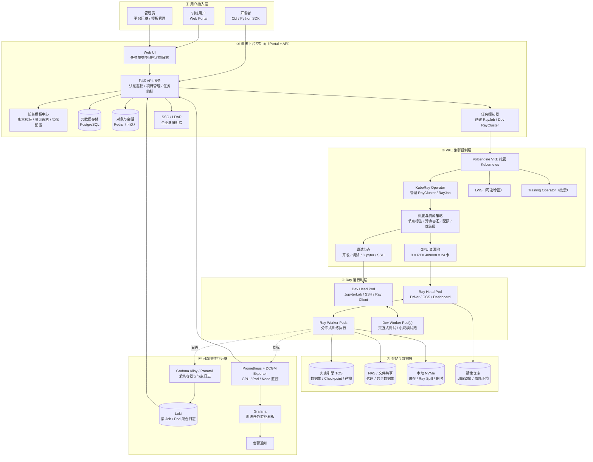

# Ray 分布式训练平台 · 架构与实现状态

本文对照最初的 V1 架构图，逐层记录**设计意图**和**当前代码的真实状态**，作为后续迭代的基准。

状态标记：✅ 已实现并验证 · ⚠️ 部分实现 · ❌ 未实现 · 🚧 被外部条件阻塞

---

## 1. 总体架构

**训练主路径**：Portal / CLI → API → RayJob → Ray Cluster
**调试主路径**：Portal → Dev RayCluster → Jupyter / SSH

---

## 2. 逐层实现状态

### ① 用户接入层

| 组件 | 状态 | 说明 |
|---|---|---|
| Web Portal | ✅ | Vue 3 + Element Plus，本地账号或 SSO 登录 |
| CLI / Python SDK | ⚠️ | Ray Jobs API 兼容网关已可达（`/ray/api/*`），版本握手与列任务正常；`ray job submit --working-dir` 因对象存储凭证无效返回 503 |
| 管理员入口 | ✅ | 角色化导航，非管理员不渲染管理组；后端每个接口独立鉴权 |

### ② 训练平台控制面

| 组件 | 状态 | 位置 |
|---|---|---|
| Web UI | ✅ | [frontend/src](../frontend/src) |
| 后端 API 服务 | ✅ | [backend/api](../backend/api)，统一 Envelope + request id |
| 任务控制器 | ✅ | [backend/k8s/reconciler.go](../backend/k8s/reconciler.go)，outbox + Lease 选主 |
| 元数据存储 | ✅ | PostgreSQL，版本化迁移 [backend/db/migrations](../backend/db/migrations) |
| SSO / LDAP | ✅ | Keycloak OIDC（LDAP 由 Keycloak User Federation 负责，平台不碰 LDAP 密码） |
| 本地账号登录 | ✅ | 与 OIDC 并行，无外部依赖即可使用 |
| 镜像目录 | ✅ | 管理员登记训练/调试镜像，用户下拉选择；强制 sha256 digest；非空时即为 allowlist |
| 私有仓库凭证 | ✅ | 令牌只入 Kubernetes Secret，库中仅存引用，经 `GIT_ASKPASS` 注入 |
| 租户自助创建 | ✅ | 一次建库记录 + namespace + Kueue 队列 |
| **任务模板中心** | ⚠️ | 镜像目录已覆盖「运行环境」这一半；脚本模板与资源规格模板仍未做 |
| Redis | ❌ | 未引入。架构图标注为可选，目前无会话/缓存需求 |

### ③ VKE 集群控制层

| 组件 | 状态 | 说明 |
|---|---|---|
| KubeRay Operator | ✅ | 1.3.0，启动时做 CRD 版本与字段校验 |
| 调度与资源策略 | ✅ | Kueue 0.19 准入 + 租户 LocalQueue 自动创建 + `suspend` 门控 + ClusterQueue 配额按节点标签自动对齐 |
| GPU 资源池 | ⚠️ | 代码与配额已按 3×8=24 设计，当前物理只有 1 卡 |
| 调试节点隔离 | ⚠️ | 节点选择器已可配置，但训练/调试尚未拆成两个标签 |
| LWS / Training Operator | ❌ | V1 不做，架构图标注为可选/按需 |

### ④ Ray 运行时层

| 组件 | 状态 | 说明 |
|---|---|---|
| RayJob 批量训练 | ✅ | 已在真实 GPU 上跑通完整闭环 |
| Head / Worker 编排 | ✅ | 均固定在训练节点池，避免落到 serverless 虚拟节点 |
| Dev RayCluster | ⚠️ | head 跑 JupyterLab + code-server，worker 持 GPU；JupyterLab 完全可用 |
| VS Code (code-server) | ⚠️ | 界面与静态资源经代理正常，**WebSocket 会话在子路径下被 404**，需独立域名或 `VSCODE_PROXY_URI` |
| 工作区生命周期 | ❌ | 无空闲 TTL 回收、无快照、无 SSH、固定 1 卡 |

### ⑤ 存储与数据层

| 组件 | 状态 | 说明 |
|---|---|---|
| 镜像仓库 | ✅ | 阿里云 ACR，镜像强制 sha256 digest |
| TOS 对象存储 | 🚧 | 代码完整（预签名上传 + 产物落盘），**当前 Secret 里的 SK 与 AK 不匹配**，TOS 一律返回 `SignatureDoesNotMatch` |
| NAS / IDC PVC | ⚠️ | 挂载逻辑就绪，当前 `IDC_STORAGE_ENABLED=false` 未启用 |
| 本地 NVMe | ⚠️ | 以 emptyDir 提供 `/tmp/ray-spill`，未绑定物理 NVMe，也未配置 Ray spill 策略 |

### ⑥ 可观测性

| 组件 | 状态 | 说明 |
|---|---|---|
| 日志查询接口 | ✅ | [backend/observability/loki.go](../backend/observability/loki.go)，按 `platform_job_id` 生成受控 LogQL |
| 指标查询接口 | ✅ | [backend/observability/prometheus.go](../backend/observability/prometheus.go) |
| Grafana Alloy 部署 | ✅ | 运行在 `monitoring` namespace（`alloy-p8j5t`），日志采集侧已就位 |
| **Loki 部署** | ⚠️ | `loki` namespace 已建但为空；chart 与 values 已备在 `vke-cluster/loki/`，尚未安装。Alloy 目前无处投递，平台日志接口取不到数据 |
| **Prometheus / DCGM 部署** | ❌ | 无 ServiceMonitor、无 GPU 指标采集 |
| **Grafana 看板 / 告警规则** | ❌ | 未编写 |

### ⑦ V1 关键能力对照

| 能力 | 状态 |
|---|---|
| 任务提交 | ✅ 已验证 |
| 状态跟踪 | ✅ 已验证（含失败正确报 FAILED） |
| 日志查看 | ⚠️ 接口就绪，缺 Loki 部署 |
| GPU 资源调度 | ✅ Kueue 准入 + 配额 + 自动回收已验证 |
| 交互式调试 | ⚠️ 基础可用，生命周期管理不全 |
| 可扩容 | ✅ 给新节点打上训练标签即可，配额自动跟随（见 [BUILD_AND_DEPLOY.md](BUILD_AND_DEPLOY.md) 第 8 节） |

---

## 3. 与原架构图的差异说明

架构图本身**没有需要修改的地方**，主体设计全部落地了。当前实现与图的差距集中在三处，都是「图上画了、代码还没做」而不是「设计走偏」：

1. **可观测性整层**（图⑥）只做了查询侧，采集侧（Alloy/Loki/Prometheus/DCGM/Grafana）一个都没部署——这是目前最大的空白。
2. **任务模板中心**（图②）做了一半：镜像目录解决了「运行环境」，脚本模板和资源规格模板还没做。
3. **Redis、LWS、Training Operator** 三个在图上就标注为「可选/按需」，V1 有意不做。

另外两处被外部条件卡住，不是设计问题：对象存储凭证无效导致代码包上传与数据读写不可用；code-server 在子路径下的 WebSocket 限制导致 VS Code 只能看到界面。

另有一处实现细节与图不同但更安全：图中 Head Pod 未标注节点约束，实际代码把 Head 也固定在训练节点池，避免它被调度到 VKE 的 serverless 虚拟节点（VCI）上导致 GCS 不可达。

---

## 4. 建议的迭代顺序

1. **修复对象存储凭据** —— 一处根因同时卡住三条线：`ray job submit` 的代码包上传、数据集读写、Checkpoint 归档。换上正确的 SK 即可，无需改代码。
2. **装 Loki** —— Alloy 已在跑，chart 也已备好（`vke-cluster/loki/`），装上并确认 Alloy 保留 `platform_job_id` 标签，日志页即可用。之后再补 Prometheus + DCGM。
3. **VS Code 独立域名** —— 给工作区分配 `vscode-<id>.内网域名`，绕开 code-server 的子路径限制。
4. **任务事件时间线与产物归档** —— `job_events` / `job_artifacts` 两张表已建但无代码读写。
5. **调试工作区生命周期** —— 空闲 TTL 回收、快照、一键固化成镜像。
6. **CI 增强** —— 目前 CI 只构建镜像，不跑 `go test` / `npm run build` / `helm lint`。
