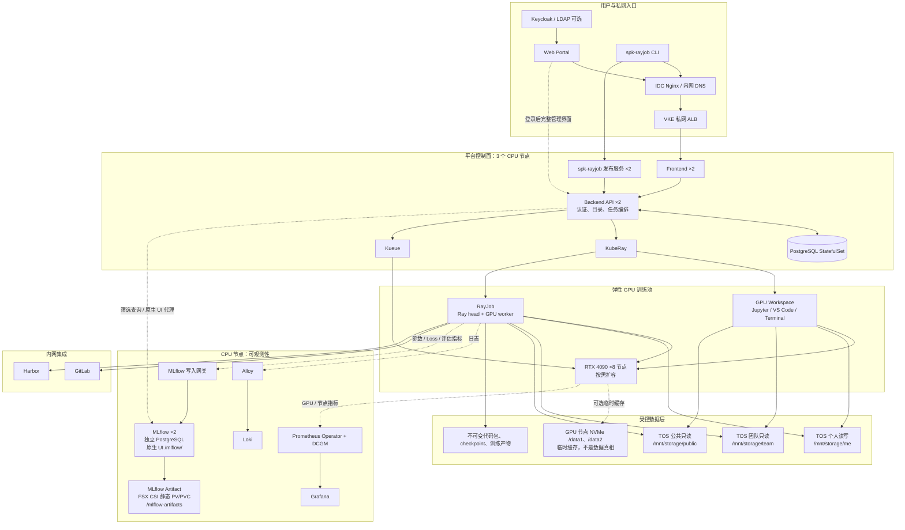

# RayTrain 生产架构

本文描述当前生产基线。部署和升级请看 [构建与部署](BUILD_AND_DEPLOY.md)，用户操作请看 [用户使用手册](USER_GUIDE.md)。

## 一图读懂

## 访问与网络边界

| 层 | 当前实现 | 目的 |
| --- | --- | --- |
| 用户入口 | `https://raytrain.wellspiking.ai` | 浏览器与 spk-rayjob 使用同一域名与同一身份体系。 |
| IDC 侧 | Nginx Ingress | IDC 内网 DNS 将 `raytrain.wellspiking.ai` 解析到统一入口；它反向代理到 VKE 私网 ALB。 |
| VKE 侧 | 私网 ALB | TLS 终止、七层路由。ALB 通过 pass-through 后端访问 ClusterIP 服务。 |
| 平台服务 | Frontend、Backend、spk-rayjob Release 都是 ClusterIP | 没有用户可访问的 NodePort；控制面不暴露节点端口。 |
| MLflow 原生界面 | 同域 `/mlflow/` → Frontend → Backend → MLflow ClusterIP | 复用平台登录；不创建 MLflow NodePort 或独立 Ingress。 |
| 工作负载 | `tenant-<tenant>` namespace | 每个租户独立队列、资源对象、数据绑定和权限边界。 |

## 控制面与高可用

- Frontend、Backend、spk-rayjob 发布服务均为 2 副本，带 HPA、PDB 和 CPU 节点反亲和；滚动升级不会中断已经创建的 RayJob。
- Backend 通过 PostgreSQL 持久化用户、目录、任务、代码包、审计与运行时状态；Kubernetes Reconciler 使用 Lease 选主，避免多副本重复创建 RayJob。
- PostgreSQL 当前是单副本 StatefulSet，使用持久卷。它是控制面唯一单点；需要跨可用区数据库高可用时，迁移到托管 PostgreSQL 或 Patroni，而不是把训练数据放到数据库中。
- KubeRay 负责 RayJob / RayCluster 生命周期；Kueue 以租户队列、GPU/CPU/内存配额控制准入。

## GPU 训练与调试

| 工作流 | 实现 | 用户看到的行为 |
| --- | --- | --- |
| 交互式调试 | 一个 Ray head + 一个带 GPU 的 worker | JupyterLab、VS Code、Terminal 代理到 GPU worker；`/workspace` 与个人数据可持续使用。 |
| 批量训练 | 一个 RayJob，包含 submitter、Ray head、按需数量的 worker | Submitter 提交 Ray runtime env；真正的训练命令只在 Ray 集群中运行。 |
| 调度 | GPU Pod 只匹配 `accelerator=nvidia-rtx-4090` 与生产池标签 | 控制面与可观测性不会占用 GPU 节点；新增 GPU 节点打标签并 Ready 后自动进入物理容量。 |
| 镜像 | Harbor 目录 + 不可变 digest | 用户只能选平台已登记的 digest 镜像；镜像拉取通过 `harbor-registry` Secret。 |

## 动态容量与团队配额

平台区分两个不能混为一谈的概念：

- **物理容量**：当前 Ready、非虚拟且带生产训练标签节点的 `allocatable` GPU、CPU、内存和节点数。
- **团队配额**：SuperAdmin 分配给某个租户的并发 GPU 预算，是管理策略，不会因扩容自动给所有团队增加。

容量控制链路如下：

1. Backend 每个协调周期读取与训练 Pod 完全相同的节点标签选择器。
2. 对 Ready 真实节点汇总总 GPU、节点数、每节点最大 GPU、CPU 和内存；虚拟节点与 NotReady 节点不计入。
3. 自动把物理总容量同步到 Kueue ClusterQueue，并更新 Portal/提交校验使用的集群能力。新增节点只需完成驱动、设备插件、健康检查和标签，不需要重建平台镜像或修改静态卡数。
4. 如果 Kubernetes API 暂时不可用或没有节点匹配，保留最后一次有效容量，不把配额瞬间降为零；进程刚启动且尚未取得有效容量时才使用部署 Profile 的保守回退值。
5. SuperAdmin 在“租户与配额”设置每个团队的 GPU 预算。新任务的有效提交上限为 `min(团队剩余可用额度, 当前物理总 GPU)`；租户额度不会反向扩大 ClusterQueue，已经占用的训练和调试 GPU 会从可提交上限中扣除。
6. Engineer 和 TenantAdmin 的 `/limits`、提交表单与 CLI 只返回本团队有效上限和本团队已用量，不展示其他团队额度。SuperAdmin 管理页额外展示物理容量、各团队预算与用量。

单任务 Worker 上限取当前可调度 Ready GPU 节点数；同构资源池的每 Worker GPU 上限就是节点卡数。若未来混入不同卡数节点，库存仍记录单节点最大卡数，但提交上限保守取所有计入节点都能满足的卡数，避免页面放出无法落盘的组合。同时总申请不得超过本团队剩余可用上限。例如 8 卡团队可以提交 `1×8` 或 `2×4`，但不能提交 `2×8`；当前 `local` 团队额度为 16，物理池也为 16，在无其他占用时可提交 `2×8`。运行中的任务在节点短暂失联时不会被平台主动终止，缩容只影响后续准入。

## 身份、角色与提交归属

- `Engineer`、`TenantAdmin`、`SuperAdmin` 是授权角色，不是任务提交人名称。
- 每个任务永久记录实际认证主体的用户 ID；Portal 使用当前交互会话，`spk-rayjob` 可使用交互会话或 PAT，原生 Ray 网关使用 PAT。任何入口都不能用角色名、共享管理员账号或客户端传入的用户名覆盖主体。
- 用户升级为 TenantAdmin 后，已有和新提交任务仍显示原用户名。例如 `guofeng.su` 升级后仍显示 `guofeng.su`，不会变成 `admin`。
- 平台 PAT 在“账户与安全 → 个人访问令牌”创建，仅用于获准的任务 CLI/API；工作区上传和快照仍要求浏览器/本地账号建立的交互会话。GitLab Token 只在“个人 Git 凭据”中用于私有代码拉取。三者不得互换、写入代码、镜像、示例或日志。
- 任何外部提交节点如果登录的是 `admin`，其任务显示 `admin` 是正确行为。交付验收中，`spk-rayjob` 与原生 Ray 必须使用 `guofeng.su` 的短期平台 PAT；Portal 快照入口必须使用 `guofeng.su` 的交互会话，不能拿管理员会话代替。

## 训练交付验收矩阵

两个 BEVFusion 分支都从 GitLab 的全新 clone 开始，不依赖任何既有本地目录或外部补丁文件。使用 `guofeng.su` 身份串行完成：

| 分支 | spk-rayjob | 原生 Ray `--working-dir` | Portal/网页 |
| --- | --- | --- | --- |
| `bev_3dod@0c1dc9d` | `SUCCEEDED` · `job-0d368c1c99570c6cfd30a704` | `SUCCEEDED` · `job-5cd8dd759fa2a481b5a0178e` | `SUCCEEDED` · `job-12a730d45f0f83e4b4ae37c5` |
| `bev_3dod_s1h@7931cee` | `SUCCEEDED` · `job-ec9a64a66c953efd346fefe8` | `SUCCEEDED` · `job-42b55a5447b7e93afe29bb87` | `SUCCEEDED` · `job-69993074d2ff5de4f2d30b17` |

六个任务均使用 `guofeng.su`，自动创建独立 RayCluster；清单固定为两个 Worker、每个 8 GPU，Worker 分布在两台 GPU 节点。日志包含 NCCL、6 个 loss iteration、验证和 checkpoint，输入来自 `/mnt/storage/public`，输出写入个人结果目录；对应 MLflow run 均为 `FINISHED`。受管入口的产物接口返回 `epoch_1.pth`、配置与 `raytrain-topology.json`。RayJob 运行时已在留存证据后清理，平台历史记录、Loki 日志、MLflow 指标和 TOS 结果保留。

最终 r9 运行镜像还以 `job-56fbc0b27e9a5b5bc4491023` 完成一条额外 `2×8` 回归任务，验证原子运行时准备锁在真实 16-rank 并发启动下可用。两个 Worker 分布在两台 GPU 节点，任务生成了 33,332,845 字节的个人 checkpoint。

面向用户的最终交付只保留五个主入口：用户使用、多方式提交、最终架构与方案、当前 BEVFusion 代码改造、新项目接入改造。文档中的命令必须能在用户自己的电脑或外部调试节点直接执行，不得要求复制平台维护者机器上的文件。

## 数据契约

训练容器没有 TOS AK/SK。TOS 访问由 CSI/FSX 的 IRSA 身份完成，平台根据登录身份和任务配置生成受控挂载。

| 逻辑空间 | Pod 路径 | 权限 | 用途 |
| --- | --- | --- | --- |
| 我的工作区 | `/workspace` | 读写 | 调试代码、虚拟环境、编辑器状态。 |
| 我的数据与结果 | `/mnt/storage/me` | 读写 | 输入副本、checkpoint、最终产物。 |
| 团队数据 | `/mnt/storage/team` | 只读 | 由 TenantAdmin 发布的数据集。 |
| 公共数据 | `/mnt/storage/public` | 只读 | 由平台管理员发布的样例或公共数据。 |
| IDC 数据（可选） | `/mnt/idc/*` | 只读 | 显式登记的 NFS 导出；当前不把个人 SSHFS 目录直接挂到每个 Pod。 |

团队共享空间区分“Portal 发布权限”和“工作负载挂载权限”：TenantAdmin 可在 Portal 的团队共享页面新建目录、上传和覆盖对象，Engineer 只能浏览和选作训练输入；当前版本不提供网页删除和下载。无论操作者角色是什么，调试与训练 Pod 中的 `/mnt/storage/team` 始终只读。SuperAdmin 以平台管理员身份管理公共空间。API 同时返回挂载只读状态和当前主体的 Portal 写入能力，前端显示“管理员可发布 · Pod 只读”，不再把两者合并成一个“只读”标签。

对象存储的正式物理布局是：

| 空间 | TOS 前缀 | 说明 |
| --- | --- | --- |
| 公共 | `tos://shanghai-data-transfer/ray-train/public/` | 全平台只读，由 SuperAdmin 发布。 |
| 团队 | `ray-train/tenants/<tenant>/shared/` | 租户内只读，由 TenantAdmin 发布。 |
| 个人 | `ray-train/tenants/<tenant>/users/<username>/` | 本人读写，用户名是稳定存储键。 |

当前 VKE Profile 已统一使用 `tos://shanghai-data-transfer/ray-train/public/` 作为全平台公共只读根。管理员将数据按 `<dataset>/<version>/` 发布到该前缀，用户只看到 `/mnt/storage/public/<dataset>/<version>`。

当前全量原始数据主要位于公共根的 `labeled/`，索引位于 `0429_pkl/`、`0813_pkl/` 等目录。任务选择公共根时，`PLATFORM_DATASET_PATH=/mnt/data/input` 对应该根；任务选择某个子目录时，该变量只对应所选子目录。代码必须使用相对所选目录的路径，不能把逻辑空间、桶名或所选子目录重复拼接进去。

数据真相在 TOS / 已登记 IDC 数据源。GPU 节点的 `/data1`、`/data2` 只能作为按任务隔离的可回收缓存；所有 checkpoint、模型和训练结果必须写入 `PLATFORM_OUTPUT_PATH`（个人 TOS 空间）。当前本地 CSI 缓存开关默认关闭，须在所有 GPU 节点统一完成 StorageClass 验收后再启用。

### NVMe 缓存生效时的链路

1. 节点把两块盘分别交给本地 CSI/LVM 存储池，不做跨盘 RAID，不向用户暴露宽泛 `hostPath`。
2. 集群提供 `ray-cache-local` StorageClass：`ReadWriteOnce`、`WaitForFirstConsumer`、`reclaimPolicy: Delete`。
3. 平台为每个 Ray head/worker 生成 generic ephemeral PVC，挂载为 `/mnt/cache`，并注入 `PLATFORM_CACHE_PATH`。
4. Ray `temp-dir` 使用 `/mnt/cache/ray`，object spilling 使用 `/mnt/cache/ray-spill/objects`。任务结束后 Pod/PVC 与缓存一起删除。

这个基线只加速 Ray 临时文件和对象溢写，**不会自动把 TOS 数据集整体预热到 NVMe**。需要数据集缓存时，应再增加基于对象 ETag/版本摘要的 initContainer 预热与容量回收机制，缓存未命中时仍从 TOS/IDC 读取。

底层 FSX 的一个租户根目录只发布一次可写 PVC；任务的输入、checkpoint 和输出只通过不同的 `subPath` 映射为逻辑目录。即使公共输入来自同一租户根，也只在容器级别以只读方式挂载，避免同一 FSX 源同时被 Kubernetes 作为读写、只读卷发布而整体退化为只读。这是平台内部实现细节，用户始终只选择逻辑目录与上表中的稳定路径。

## 可观测性

- Loki 运行 3 个副本，网关 2 副本；用于容器日志检索。
- Prometheus Operator、Prometheus 2 副本、Alertmanager 2 副本、Grafana 2 副本运行于 CPU 节点。
- DCGM Exporter 采集 GPU 指标；Node Exporter、kube-state-metrics 采集节点和 Kubernetes 指标。
- Alloy 当前为 2 个 CPU 节点副本。它通过 Kubernetes API 发现容器日志；若未来需要采集 GPU 节点宿主机文件或本地缓存指标，应将 Alloy 改为覆盖 GPU 节点的 DaemonSet，并保持其日志标签与现有 Loki 查询兼容。
- MLflow 以 2 副本部署在独立 `mlflow-system` namespace，元数据使用独立 PostgreSQL。Artifact 存储通过 FSX CSI 静态 PV/PVC 将 `vke-cluster/ray-train/platform/mlflow-artifacts/` 这一专用前缀发布给 MLflow；`Retain` 的 PV 与 `mlflow-system/mlflow-artifacts` PVC 固定绑定，不与用户数据卷混用。
- MLflow Pod 只看到 `/mlflow-artifacts` 挂载根，Artifact destination 是 `file:///mlflow-artifacts`；Pod 不直连对象存储，也不注入 TOS/AWS AK/SK。FSX CSI 的 `fsx-agent` 使用平台 Secret `ray-train-platform/tos-fsx-credentials` 完成挂载，凭据不进入 MLflow Pod。训练 Pod 只访问写入网关，不能通过该网关搜索其他运行或下载 Artifact。
- 实验中心是平台筛选视图：Backend 读取 MLflow 后再用平台数据库校验租户、任务和提交人，Engineer 只看到自己的运行，TenantAdmin/SuperAdmin 查看授权范围内的团队运行。Ray Dashboard 随任务集群回收，MLflow 指标和 Loki 日志独立持久保留。
- 原生 MLflow 是登录后可访问的完整管理界面，通过同域 `https://raytrain.wellspiking.ai/mlflow/` 进入。所有平台认证用户都能看到全平台实验，并可创建、修改、删除实验、Run 和模型注册条目，也可上传、下载 MLflow Artifact。原生 MLflow 全功能开放是当前明确策略，平台只控制入口认证，不对进入后的 MLflow 功能做二次裁剪。
- 原生界面由 Frontend 把 `/mlflow/` 转给 Backend，再由 Backend 代理到 MLflow ClusterIP；MLflow 不创建 NodePort、不创建独立 Ingress。一次性票据交换为仅限 `/mlflow/` 的安全 Cookie，修改类请求还必须通过同源校验。
- MLflow Artifact 与 `/mnt/storage/public` 治理数据隔离。Artifact 上传下载只在 MLflow 的专用挂载根中执行，不等于允许下载公共数据，也不改变公共/团队目录只读策略。

## 内网依赖与不做的事

- GitLab：允许 `gitlab.wellspiking.ai`、`gitlab.qomolo.com`。私有 Git 凭据由用户或租户保存为 Secret 引用，不回显。
- Harbor：训练镜像由用户团队推送至 `harbor.wellspiking.ai/<project>`，管理员登记 digest 后可选。
- Keycloak / LDAP：本地账号和 OIDC 可以并行。LDAP 由 Keycloak federation 负责，Portal 不保存 LDAP 密码。
- IDC ↔ TOS 双向迁移尚未作为生产入口开放；在此之前，公共/团队数据通过管理员受控发布，个人数据由个人空间上传或已验证的外部提交流程进入。
