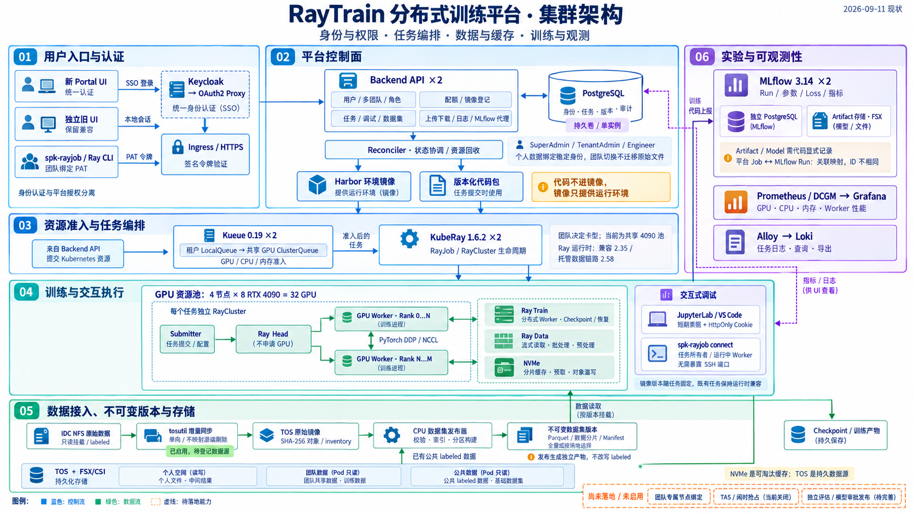

# RayTrain 平台现状与交接快照

核对日期：2026-09-11（北京时间）。依据：四端实时 Git 查询、构建机与生产集群只读查询、当前后端代码。本文区分已实现、已启用和真实验收；不包含 IP、凭据和用户数据内容。

后续变更：2026-09-12 GPU 配额与 MLflow 功能已发布，参见 [发布验证记录](QUOTA_MLFLOW_VALIDATION_20260912.md)。随后实验中心改为“训练记录 / MLflow API”，使用说明调整为六分类、34 篇独立问题文档，旧七主题接口继续兼容；最新版本与证据见 [用户体验修正](HELP_CONTENT_COVERAGE_20260912.md)。随后共享模型目录与权重版本第一阶段已发布：后端 revision 221 / schema 49，Portal 新增“模型”，使用说明共36篇问题；证据与待验收边界见 [共享模型发布验证](MODEL_LIFECYCLE_VALIDATION_20260912.md)。随后独立评估第二阶段代码和页面已发布：后端 revision 222 / schema 50，实验中心新增“评估”，使用说明38篇；生产专用任务源码下载超时，成功报告链路尚未验收，见[第二阶段发布记录](MODEL_EVALUATION_VALIDATION_20260912.md)。以下内容保留为 9 月 11 日历史快照，不作为当前线上版本。

## 1. 生产代码基线与文档交付

2026-09-12后续内网评估修复：业务提交 `3fb0b67`、后端revision223/schema50，Portal dev `74f036ae`（CI33883，revision1050）。已支持上传ZIP不可变快照及任务凭据内网下载；隔离测试通过，新的生产协议验收因浏览器工具文件权限卡在上传前，尚无成功报告证据。最新范围与未完成项以[评估发布记录](MODEL_EVALUATION_VALIDATION_20260912.md)开头为准。

本次文档同步前核查到的业务源码基线四端一致：

| 代码端 | 分支 | 完整提交 SHA |
| --- | --- | --- |
| 本地 ray-train-platform | main | 59874280a8058d294cdc36ed21e7bdac532858f7 |
| GitHub origin | main | 59874280a8058d294cdc36ed21e7bdac532858f7 |
| 内部 GitLab gitlab | main | 59874280a8058d294cdc36ed21e7bdac532858f7 |
| 构建机 ray-platform-main | main | 59874280a8058d294cdc36ed21e7bdac532858f7 |

核查开始时本地和构建机均干净。用户随后授权将本轮 skill、交接文档和架构图提交并同步四端；该文档提交在上表基线之后，不包含业务代码变更，也不构建或部署镜像。当前交付 SHA 请实时查询四端 main，而不是把本页的历史业务基线当作最新文档提交号。线上版本仍单独按下表的镜像 digest、Helm revision 核对。

Portal 是独立的前端代码面，不属于上表四端。其 GitLab `dev` 实时 HEAD 为 `9bca129581a36070b5e1c301c4b9b3a6680a1b91`。本机另一份 Portal checkout 处于 `master`，不能当作 dev 的发布源。本次无法连接 test-dev Kubernetes API，未重新确认 Portal 最新 CI 结果、线上镜像和登录后的全量页面，不宣称已经完成这三项验收。

### 线上运行版本

| 组件 | 当前观测 |
| --- | --- |
| 后端 | release-20260911-12；2 个 Ready 副本，重启数均为 0 |
| 后端镜像 | sha256:93bc46b59db697175971d86e85791f1b0199c1e986532bbc5cbbb71c1a1043c7 |
| Helm | ray-platform，revision 211，状态 deployed |
| 数据库 schema | 45 |
| 独立旧前端 | release-20260909-mlflow-run-links；2 个 Ready 副本；sha256:293b7acb89711e2f31d61b85948bf67b651569728d4ed460d1721ea7a48506f7 |
| spk-rayjob 下载服务 | release.json 的 latestVersion 为 release-20260911-11；2 个 Ready 副本 |
| spk-rayjob 服务镜像 | sha256:a8ec746b9747f3637dab0f4299263c932c903a1d4d31f20ebadedc1639638410 |
| KubeRay | 1.6.2，2 个 Ready 副本 |
| Kueue | 0.19.0，2 个 Ready 副本 |
| MLflow | 3.14.0，2 个 Ready 副本 |
| Ray | 兼容多运行时；本次运行中 RayJob 清单包含 2.35.0 和 2.58.0，不能说全平台都是 2.58 |

源代码 SHA、镜像 digest、Helm revision、CLI release 和 Portal commit 是不同版本维度。组件未变更时不需要为了统一 tag 重建镜像。本次 `/healthz` 返回 200；只读观测到 3 个 RUNNING 训练任务，未提交、停止或重启任务。

## 2. 集群与业务现状

### 身份、团队与个人数据

- 新 Portal 走 Keycloak/OAuth2 Proxy。后端验证转发令牌的签名与身份，不信任客户端自行填写的用户名头。
- 本地账号登录与平台 PAT 仍启用，旧前端和 CLI 继续兼容；Portal 角色不能直接赋予平台 SuperAdmin。
- 平台成员与角色表决定授权。用户有稳定身份、多团队 membership、当前团队；PAT 绑定团队。
- SuperAdmin 可以管理团队、显示名、成员和当前团队。历史归属记录不授予访问权；停用 membership 后旧团队 PAT 不再获得该团队权限。
- 个人空间绑定稳定 storage home，不随当前团队或显示名改变；团队数据和配额跟随当前团队。旧任务、审计和产物不自动迁移到新团队。

已核实的管理结果：

| 团队内部 ID | 显示名 | GPU 配额 |
| --- | --- | ---: |
| local | 感知应用算法团队 | 24 |
| algorithm | algorithm | 8 |
| devops | DevOps | 0 |

`zihao.liu`、`xin.gong` 当前团队均为 devops，个人存储归属仍是 local。local 的 24 卡配额没有减少。

### 计算与调度

- 4 台 GPU 节点，每台 8 张 RTX 4090，总计 32 卡；均 Ready、可调度且 cache-ready。
- 当前 GPU 使用共享 `cluster-gpu-queue`，nominal GPU quota 为 32；数据集发布另用 CPU 队列。
- 已有按团队选择 accelerator class 的后端逻辑，用户不需要在提交命令中指定卡型。代码支持 4090/A100/A800/H20，但当前实际 GPU 池只有 4090，异构实机尚未验收。
- **团队专属物理节点池尚未落地**：GPU 节点没有团队归属标签，当前不能承诺团队之间物理隔离。
- **TAS 和闲时抢占当前关闭**：`KUEUE_TOPOLOGY_ENABLED=false`、`KUEUE_PREEMPTION_ENABLED=false`；GPU ResourceFlavor 未关联 Topology，ClusterQueue 抢占策略为 Never。
- 闲时任务有 priority/preemptible/checkpoint 校验代码，但当前开关会拒绝其提交，不能描述为用户已经可以使用。代码要求单 Worker、单 GPU 和托管 checkpoint 恢复；仍需开关、资源配置及真实抢占演练共同验收。
- 因此本次不能声称“GPU 碎片彻底解决”“团队有卡时一定能立即运行”或“闲时任务会自动让路”。本次核查没有修改这些开关。

### 训练、数据与缓存

- 两种提交入口：spk-rayjob 与原生 Ray Jobs 网关；两种训练引擎：兼容 Ray 编排 DDP 与托管 Ray Train。
- 代码包与环境镜像分离。Harbor/登记镜像提供依赖环境，代码通过受控源码包或允许的来源进入任务；不需要每次改代码都构建镜像。
- KubeRay 创建任务级 RayCluster：Submitter、无 GPU 请求的 Head、GPU Workers。Ray Train 管理分布式 worker 和恢复；实际梯度同步由训练框架/DDP/NCCL 完成。
- 版本化数据、数据集发布器、Ray Data streaming、托管 Ray Train 和本地缓存开关已开启。
- 配置契约分为通用 `ray-data`/`ray-data-stage` 与固定版本的 `streaming`。后者使用受管版本来源，不能同时填写通用 `Managed.RayData` 参数；运行时仍会构造 Ray Dataset 并传给 TorchTrainer，不能据此误判为“streaming 没有使用 Ray Data”。
- 数据发布器读取公共 labeled 或指定来源，生成独立的不可变版本、Manifest、索引、Parquet/分片，不改写 labeled。Parquet 不代表每个原始文件都塞进同一个 Parquet 文件。
- 训练可以固定版本并选择场地；Ray Data 负责流式读取、批处理和预处理，NVMe 缓存承担分片预取与对象溢写。NVMe 可淘汰，TOS 是持久来源，不要求把全量数据同时放到缓存盘。
- 个人空间支持本人管理读写；训练的受控 input/checkpoint 挂载只读，output 是本人 my-runs 下的任务专属可写目录。团队、公共和 IDC 数据在 Pod 中只读；管理页面的发布权限与 Pod 挂载权限是两层控制。
- 使用托管链路不等于每个旧任务都会自动改成 Ray Train/Ray Data；需要匹配的提交配置、数据契约和训练代码。

### IDC 同步与模型生命周期

- IDC 同步功能已部署且开启；worker 通过只读 NFS 访问源数据，用 tosutil 增量同步，并生成 SHA-256 原始对象和 inventory。
- 默认不将源端删除映射成 TOS 删除；数据集版本可记录源 SyncRun/inventory 摘要。
- **当前连接器数为 0、同步 Run 数为 0**。这说明能力已上线，但尚未建立实际数据源和完成真实同步验收；不能说全量 labeled 已开始自动同步。
- 已有训练事件、checkpoint、artifact 和 MLflow 关联；本次代码核查未发现独立评估任务、模型审批、生产别名提升和外部模型仓 outbox 的完整一等流程。
- 因此完整生命周期仍需补齐“固定评测版本 → 独立评估 → 候选模型包 → 审批 → 发布/回滚”，不可在架构图中画成已完成的生产闭环。

### 调试与可观测性

- 交互式环境提供 JupyterLab/VS Code，通过平台短期票据、HttpOnly Cookie 和反向代理访问，不向用户开放集群管理凭据。
- `spk-rayjob connect JOB_ID --worker N` 已实现，经平台 WebSocket 连接运行中的 Worker；服务端限定任务所有者、状态和 Worker 序号，不让客户端任意选择 Pod/命令，也不需要暴露 SSH 端口。
- MLflow 记录 Run、参数和指标，平台 Job 与 MLflow run_id 是关联关系，ID 不相同。Artifact/Model 仍需训练代码显式记录；Ray Data 不会自动生成 loss 曲线。
- MLflow 使用独立 PostgreSQL 与 FSX artifact PVC。平台 PostgreSQL 和 MLflow PostgreSQL 当前各为单实例，不应把后端多副本描述成数据库也高可用。
- Prometheus/DCGM/Grafana 提供资源观测，Alloy/Loki 保存与查询日志，后端向 UI 聚合任务、Worker、实验和产物信息。

## 3. 开发、构建、发布与排障

唯一维护的流程入口是 [Codex release skill](../.agents/skills/release/SKILL.md)；[Claude 入口](../.claude/skills/release/SKILL.md) 只引用它，避免再次维护两套发布规范。

后端流程：

1. 本地编辑并审阅差异，确认受影响组件；测试、编译和构建均在构建机。
2. 以 guofeng.su 平台身份形成候选 commit，用 Git bundle 送到构建机 detached worktree。
3. 在隔离环境跑 Go/真实 PostgreSQL 等相关测试；通过后才在获准范围内推 GitHub、内部 GitLab并快进正式构建目录，核对四端 SHA。
4. 只构建改动组件。修改 CLI 时同步更新 backend 与 spk-rayjob 下载服务；修改 IDC worker 时构建 idc-sync；不使用默认 all 重建大量环境镜像。
5. 备份 values；涉及数据库迁移还需可恢复数据库备份和兼容性证据。只用最小镜像覆盖做 Helm server-side dry-run，逐项审阅清单差异，再滚动发布。
6. 验证实际 imageID、健康检查、获准身份 API/浏览器行为，以及既有训练资源 UID/重启数。Helm atomic 回滚不回滚已经提交的数据库迁移。

Portal 流程：

1. 使用独立 Portal 仓库的 dev 候选，不拿另一个 master checkout 或本仓库 frontend/ 代替。
2. 在构建机运行该候选的 Dockerfile.lint、路由和访问合同等门禁；审查归档避免携带敏感配置。
3. 通过后推 Portal dev，由其 GitLab CI/CD 构建、部署；前端不写入后端 Helm 覆盖。
4. 分别确认 push、CI、线上镜像、登录后的列表/详情/使用说明/MLflow/调试页面。无法访问某一层就记录未验证，不以首页 200 代替端到端验收。

排障遵循：[用户入口 → 网络/认证 → 后端权限/数据合同 → Kueue 准入 → RayJob/Pod → 节点/存储/训练代码 → 日志/指标](../.agents/skills/release/references/diagnostics.md)。训练提交验收使用 [spk-rayjob 真实提交流程](../.agents/skills/release/references/acceptance.md)，仅在用户授权和容量允许时进行。

本轮 skill 修订补齐：先测试再推送、实时远端查询、前后端分仓、MLflow 网关路径、IDC 构建目标、归档包含已跟踪 env 的风险、运行中任务的安全发布条件、真实 PostgreSQL 迁移验证、数据库备份/回滚边界，以及“已实现/启用/验收”的区分。Codex skill 与 Claude 兼容入口经过构建机格式校验和独立只读审阅；文档发布不替代业务功能验收。

## 4. 当前架构图

图中虚线区明确标出尚未落地的能力；没有 IP、账号、凭据或任务 ID。图片使用内置 imagegen 生成，事实与边界以本文为准。[完整生成提示词](architecture/raytrain-cluster-20260911-prompt.md) 保留便于后续更新。

## 5. 建议后续顺序

1. 先在不影响现有训练的窗口落实团队节点池/卡型边界，再配置匹配的 Kueue Topology 和队列，并分别做小任务、多机、闲时抢占及 checkpoint 恢复演练。
2. 登记 IDC 数据源，先小目录 PLAN/SYNC，再验收修改、重复同步、源删除、inventory 完整性和失败重试，随后切换全量同步。
3. 打通独立评估与模型发布，不把训练进程退出成功当作模型验收通过。
4. 补齐 Portal 最新 CI/镜像/登录 E2E 的证据，并规划平台与 MLflow 数据库备份恢复及高可用。

以上是后续建议，本次没有执行这些变更。
