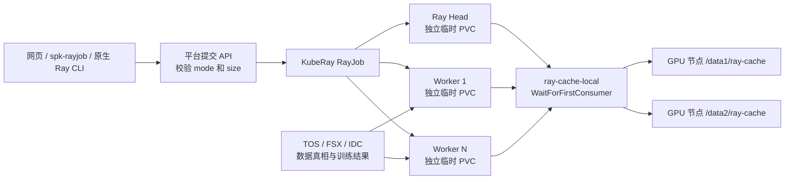

# GPU 节点 NVMe 缓存加速指南

本文单独说明 Ray 训练平台已经上线的节点本地 NVMe 缓存：它解决什么问题、当前如何实现、用户如何启用、训练代码如何真正利用它，以及管理员如何验收和排障。

## 1. 先给结论

当前生产环境已经具备可选的 `runtime` 缓存能力：

- 两台生产 GPU 节点各使用 `/data1/ray-cache`、`/data2/ray-cache` 两个独立缓存根；
- Kubernetes 提供非默认 StorageClass `ray-cache-local`；
- 用户可为单个任务选择 `100Gi`、`200Gi` 或 `500Gi`；
- 缓存默认关闭，只影响新提交且主动选择 `runtime` 的任务；
- Ray Head 和每个 Worker 各获得一个独立临时卷，容器内统一挂载到 `/mnt/cache`；
- Ray session、临时目录和 object spilling 会自动使用 NVMe；
- `/mnt/storage/public`、团队目录、个人目录、Checkpoint 和训练结果不会被自动迁移到 NVMe；
- 任务 Pod 删除后，对应 PVC、PV 和节点目录自动回收。

训练镜像不需要因为启用缓存而重建。普通训练代码即使完全不认识缓存也能继续运行；只是这种情况下，只有 Ray 自身的临时文件和 object spilling 会使用 NVMe，PyTorch DataLoader 仍从原数据目录读取。

## 2. 当前生产状态

截至 2026-08-25，集群中的实际状态为：

| 项目 | 当前值 |
| --- | --- |
| Helm release | `ray-cache-local`，状态 `deployed` |
| Namespace | `ray-cache-local` |
| StorageClass | `ray-cache-local` |
| Provisioner | `rancher.io/local-path` |
| 绑定方式 | `WaitForFirstConsumer` |
| 回收策略 | `Delete` |
| 平台开关 | 已启用，任务默认 `off` |
| 可选容量 | `100Gi`、`200Gi`、`500Gi` |
| 默认 runtime 容量 | `200Gi` |
| 容器挂载点 | `/mnt/cache` |
| GPU 节点 | 2 台生产节点 |
| 每节点缓存盘 | `/data1`、`/data2`，各约 3.78 TB 十进制容量 |
| 当前每盘可用空间 | 约 3.59 TB 十进制容量 |
| 监控 | 2 个节点监控 Pod，Prometheus ServiceMonitor 和告警规则已启用 |

这些容量数字是状态快照，不应写入容量规划脚本。日常判断以 Prometheus 指标和实时 `df` 为准。

## 3. 架构与生命周期



一次 `2 Worker × 8 GPU` 的 runtime 缓存任务会创建：

- 1 个 Head 临时 PVC；
- 2 个 Worker 临时 PVC；
- 共 3 个独立本地卷。

因此界面中的 `200Gi` 表示每个 Head/Worker Pod 的请求容量，不是整个任务合计 200Gi。`N` 个 Worker 的任务会产生 `N + 1` 个临时 PVC。Submitter Pod 不挂载缓存。

任务删除时，generic ephemeral PVC 的所有者引用触发以下回收链路：

```text
Pod 删除 → 临时 PVC 删除 → PV 删除 → helper Pod 删除精确的节点缓存目录
```

成功任务默认很快释放 RayCluster；失败任务会保留更长的原生诊断窗口，因此失败任务的缓存目录也可能多保留一段时间。

## 4. 缓存能加速什么

### 4.1 自动生效的部分

选择 `runtime` 后，平台自动为 Head 和 Worker 配置：

```text
PLATFORM_CACHE_PATH=/mnt/cache
Ray temp-dir=/mnt/cache/ray
Ray object spilling=/mnt/cache/ray-spill/objects
```

这会改善以下负载：

- Ray session 和运行时临时文件较多；
- Ray Object Store 内存不足，需要把对象 spill 到磁盘；
- 用户代码主动把解压文件、中间特征、编译缓存或临时 shard 写到 `$PLATFORM_CACHE_PATH`。

### 4.2 不会自动生效的部分

下列路径不会因为勾选缓存而改变：

| 数据类型 | 仍使用的路径 | 是否持久 |
| --- | --- | --- |
| 公共训练数据 | `/mnt/storage/public` 或 `PLATFORM_DATASET_PATH` | 是 |
| 团队数据 | 平台选择后映射的团队目录 | 是 |
| 个人工作区 | `/mnt/storage/me` | 是 |
| Checkpoint 输入 | `PLATFORM_CHECKPOINT_PATH` | 是，只读 |
| 训练结果 | `PLATFORM_OUTPUT_PATH` | 是，可读写 |
| 本地缓存 | `PLATFORM_CACHE_PATH=/mnt/cache` | 否 |

BEVFusion、PyTorch DDP 等代码如果继续把 `dataset_root` 指向 `/mnt/storage/public/...`，DataLoader 仍直接读取 TOS/FSX。仅启用 runtime 缓存不会自动提高这部分吞吐。

## 5. 用户如何启用

### 5.1 网页提交

1. 打开“创建训练任务”。
2. 进入“运行规模”。
3. 在“一次性运行时缓存”选择“运行时缓存”。
4. 选择 `100Gi`、`200Gi` 或 `500Gi`。
5. 正常选择数据、Checkpoint、输出目录并提交。

提交预览会显示缓存模式和容量。若页面没有这个选项，说明平台 API 当前没有发布 runtime 能力，不要在代码中自行假设 `/mnt/cache` 一定存在。

### 5.2 spk-rayjob：单次命令

在已有提交命令中增加两个参数：

```bash
spk-rayjob submit \
  --cache-mode runtime \
  --cache-size 200Gi \
  --watch
```

其他镜像、资源、数据和入口参数保持原样。临时关闭缓存：

```bash
spk-rayjob submit --cache-mode off --watch
```

### 5.3 spk-rayjob：项目默认值

可在代码仓库的 `.spk-rayjob.yaml` 中加入：

```yaml
cache:
  mode: runtime
  size: 200Gi
```

命令行参数优先于项目文件。建议项目文件仍以 `off` 为默认，只有确认任务确实受临时 I/O 或 object spilling 限制后再长期打开：

```yaml
cache:
  mode: "off"
```

### 5.4 原生 ray job submit

在现有 `--metadata-json` 中增加两个字符串字段：

```bash
export RAY_ADDRESS='https://raytrain.wellspiking.ai/ray'
export RAY_JOB_HEADERS='{"Authorization":"Bearer <个人访问令牌>"}'

IMAGE='harbor.wellspiking.ai/<个人项目>/<训练镜像>@sha256:<digest>'
RUN_ID="$(date +%Y%m%d-%H%M%S)"
META="$(jq -cn --arg image "$IMAGE" '{
  "ray-platform.image":$image,
  "ray-platform.worker-replicas":"2",
  "ray-platform.gpus-per-worker":"8",
  "ray-platform.cpu-per-worker":"64",
  "ray-platform.memory-per-worker":"256Gi",
  "ray-platform.queue":"local-gpu",
  "platform.cache.mode":"runtime",
  "platform.cache.size":"200Gi"
}')"

ray job submit \
  --submission-id "my-training-${RUN_ID}" \
  --working-dir . \
  --metadata-json "$META" \
  -- \
  python3 train.py
```

只提供 `platform.cache.size`、使用未知的 `platform.cache.*` 字段或提交不在 allowlist 中的容量都会被平台拒绝。

## 6. 训练代码如何真正缓存数据

### 6.1 不改代码

不改代码也可以启用 runtime 缓存。此时获得的是 Ray 临时目录和 object spilling 加速，训练数据读取路径不变。

这是最安全的第一步，适用于先观察 Ray spill、临时文件和训练总耗时是否改善。

### 6.2 显式预热热点数据

要让 DataLoader 从 NVMe 读取，训练代码必须显式把需要的子集复制到 `PLATFORM_CACHE_PATH`，然后把实际 `dataset_root` 指向复制后的目录。

不要把 10 TB 公共数据全量复制到每个任务。应只预热当前实验真正使用的版本、场景或 shard。

平台交付了一份可直接放进用户代码仓库的完整脚本：

[`examples/dataset-cache/stage_dataset.py`](../examples/dataset-cache/stage_dataset.py)

把该文件保存为自己仓库的 `tools/stage_dataset.py`。它具有三个行为：

- 没有启用缓存时直接返回原 `PLATFORM_DATASET_PATH`；
- 每个 Worker Pod 只让 `LOCAL_RANK=0` 复制一次；
- 同一 Worker 的其他 GPU rank 等待原子 `.ready` 标记后再读取。

入口命令先执行脚本，再导出脚本返回的真实数据根：

```bash
PLATFORM_DATASET_PATH="$(python3 tools/stage_dataset.py)"
export PLATFORM_DATASET_PATH
python3 tools/train.py --data-root "$PLATFORM_DATASET_PATH"
```

`.spk-rayjob.yaml` 的关键配置：

```yaml
entrypoint: >-
  PLATFORM_DATASET_PATH="$(python3 tools/stage_dataset.py)";
  export PLATFORM_DATASET_PATH;
  python3 tools/train.py --data-root "$PLATFORM_DATASET_PATH"
cache:
  mode: runtime
  size: 100Gi
input:
  space: public
  path: <本次训练精确使用的数据集版本或 shard>
```

脚本会复制整个“任务选中的输入根”。因此 `input.path` 绝不能留空后指向 10 TB 的
`public` 根；必须在页面或配置中选择本次训练真正使用的最小只读目录。所选目录实际容量
必须小于每个 Worker 的缓存容量，并留出 Ray 临时目录和 object spilling 空间。

如果程序自行初始化 `torch.distributed`，脚本的本地 `.ready` 只负责同一 Worker 内同步；
所有 Worker 都进入训练后，DDP 初始化本身会形成全局同步。自定义启动器也可以在预热后
增加一次全局 barrier。

### 6.3 适合放入缓存的内容

- 当前任务反复读取的只读数据 shard；
- 解压后的临时数据；
- 可重新生成的中间特征；
- JIT、CUDA 扩展或框架临时缓存；
- Ray object spilling 文件。

### 6.4 绝不能只放在缓存里的内容

- 最终模型；
- 唯一一份 Checkpoint；
- 训练报告和指标；
- 用户源码的唯一副本；
- AK/SK、PAT、Git Token、SSH 私钥；
- 无法从 TOS、IDC 或代码重新生成的数据。

最终 Checkpoint 和模型必须写入 `PLATFORM_OUTPUT_PATH`。

## 7. 容量语义与限制

当前实现基于 Rancher Local Path Provisioner。`100Gi`、`200Gi`、`500Gi` 是平台准入、调度和审计使用的请求容量，不是底层文件系统硬配额。

供应器在创建目录前会检查：

- 请求容量不能超过当时可用空间；
- 按请求容量计算后，文件系统必须至少保留 15% 空间；
- 目标必须位于精确的 `/data1/ray-cache` 或 `/data2/ray-cache`；
- 只能在已登记的生产 GPU 节点供应。

但目录创建后，Linux 文件系统不会阻止任务实际写入超过所选容量。用户代码必须遵守所选容量；平台通过受控并发、磁盘水位和告警保护节点，而不是依赖目录硬配额。

如未来必须实现严格容量隔离，需要在维护窗口迁移到经过验证的 Local CSI/LVM、XFS project quota 或其他具有真实限额能力的方案，不能把当前 PVC request 当成硬限制。

### 7.1 两块 3.5 TB 是否够用

2026-08-25 实测每台 GPU 节点的 `/data1`、`/data2` 各可用约 3.587 TB，合计约
7.174 TB（约 6.52 TiB）。两台节点总计约 14.35 TB，但本地盘不共享：

- 同一份 10 TB 数据如果每个 Worker 都需要完整副本，单节点放不下；
- 如果数据可以按节点稳定分片，10 TB 约为每节点 5 TB，容量上可行，但必须保留至少
  15% 水位并考虑临时文件；
- 当前平台单个 Head/Worker 只允许申请到 500Gi，因此现阶段定位是“实验热点子集缓存”，
  不是全量 `public` 镜像；
- 新增 GPU 节点只增加本地总容量，不会让一个 Worker 自动看到其他节点的缓存。

因此两块盘足够缓存多数单次实验的热点数据和 Ray 临时文件，但不足以在每台节点复制
一份约 10 TB 的全量数据。全量缓存需要第二阶段的数据集分片、manifest、断点预热和
跨任务复用能力。

## 8. 如何验证是否真正使用 NVMe

训练程序可以打印：

```python
import os
from pathlib import Path

cache = os.environ.get("PLATFORM_CACHE_PATH", "")
print(f"PLATFORM_CACHE_PATH={cache or '<disabled>'}", flush=True)
if cache:
    probe = Path(cache) / "write-probe.txt"
    probe.write_text("ok\n", encoding="utf-8")
    print(f"cache write probe={probe} bytes={probe.stat().st_size}", flush=True)
```

任务日志中应看到：

```text
PLATFORM_CACHE_PATH=/mnt/cache
cache write probe=/mnt/cache/write-probe.txt bytes=3
```

管理员还可以确认生成的 RayJob：

```bash
kubectl -n <tenant-namespace> get rayjob <rayjob-name> -o yaml
```

Head 和 Worker 模板中应包含：

- `ephemeral.volumeClaimTemplate`；
- `storageClassName: ray-cache-local`；
- `/mnt/cache` volumeMount；
- `PLATFORM_CACHE_PATH=/mnt/cache`；
- Ray `temp-dir` 指向 `/mnt/cache/ray`，支持 Ray 2.35 的
  `RAY_object_spilling_config` 环境变量指向 `/mnt/cache/ray-spill/objects`。

Submitter 模板不应包含这些字段。

## 9. 如何证明数据读取真的变快

不要只比较第二次 `cat` 或单个文件读取。Linux 页缓存、FSX 客户端缓存和对象存储后端缓存都会影响结果。

建议使用同一镜像、同一数据 manifest、同一 Worker 数和同一训练参数做两组实验：

1. `cache.mode=off`，DataLoader 直接读取 `PLATFORM_DATASET_PATH`；
2. `cache.mode=runtime`，先预热相同数据 shard，再让 DataLoader 读取预热目录。

同时记录：

- 预热耗时与复制字节数；
- 第一个 epoch 和后续 epoch 的耗时；
- MiB/s、files/s、P95 单文件延迟；
- GPU 利用率和 GPU 等待数据比例；
- 总训练 wall time。

runtime 缓存不会跨任务复用。若训练只有一个很短的 epoch，预热成本可能高于收益；多 epoch、重复读取、小文件密集或数据加载明显让 GPU 空转的任务更可能获益。

### 9.1 已验证结果

读取基准固定为 2 个 Worker、8,192 个文件、5.20 GB：

| 路径 | 吞吐 | files/s | 单文件 P95 |
| --- | ---: | ---: | ---: |
| 持久数据首次读 | 19.140 MiB/s | 31.618 | 约 146 ms |
| 持久数据重复读 | 114.849 MiB/s | 189.727 | 约 15 ms |
| NVMe 预热后读 | 5,625.340 MiB/s | 9,292.892 | 约 1.8 ms |

NVMe 预热本身耗时 223.146 秒。紧接预热后的本地读取同时受 NVMe 和 Linux 页缓存影响，
所以这是“任务真实热路径”而不是裸盘测速。

BEVFusion smoke-128 的 2×8 训练也按同一代码、镜像和参数完成 A/B：

| 指标 | 缓存关闭 | NVMe 数据预热 |
| --- | ---: | ---: |
| 任务 | `job-c3427242dc13857bfd225968` | `job-171387b7aed9cbe613b4616f` |
| 预热 | 无 | 963 文件、961.6 MB、48.9 秒/Worker |
| 第一步 `data_time` | 3.735 s | 2.398 s |
| 后 5 步平均 `data_time` | 0.0062 s | 0.0036 s |
| 后 5 步平均 `time` | 0.2606 s | 0.1690 s |
| 结果 | SUCCEEDED | SUCCEEDED |

这项 smoke 只有 6 个 iteration，只证明数据根确实切换到 NVMe、DDP/训练/验证/结果链路
正常，不能把后 5 步的百分比直接当作全量训练 SLA。计入 48.9 秒预热后，短任务总墙钟
更慢。正式收益必须按 300～500 个稳态 iteration 或完整多个 epoch 测量。

## 10. 管理员部署与验收

### 10.1 交付测试

```bash
cd /opt/guofeng/vke-cluster/ray-platform
bash scripts/test-nvme-cache-delivery.sh
```

这一步检查 Helm 渲染、容量门禁、回收安全、监控清单和运维脚本，不创建训练任务。

### 10.2 安装或升级

```bash
cd /opt/guofeng/vke-cluster/ray-platform
bash ops/storage/nvme-cache/install.sh
```

`install.sh` 会先执行只读节点预检和完整交付测试，再使用固定 production values 做 Helm `--atomic --wait` 部署。不要绕过 preflight，也不要临时使用 `--set` 改节点目录。

### 10.3 真实供应与回收验收

```bash
cd /opt/guofeng/vke-cluster/ray-platform
bash ops/storage/nvme-cache/verify.sh
```

该脚本会在每个已登记 GPU 节点创建临时 smoke Pod/PVC，验证：

- `WaitForFirstConsumer` 和节点亲和；
- `/mnt/cache` 可写；
- PVC/PV 删除；
- 节点缓存目录最终消失。

这是会创建和删除临时 Kubernetes 资源的验收操作，应在明确的变更窗口执行。

### 10.4 新增 GPU 节点

新节点必须先具备两块独立挂载盘，并准备：

```text
/data1/ray-cache
/data2/ray-cache
```

目录必须是可信的真实目录，不能是符号链接。完成节点标签、权限、容量和写删检查后生成只供评审的 values patch：

```bash
bash ops/storage/nvme-cache/register-node.sh \
  --node <Kubernetes节点名> \
  --output-dir ./nvme-cache-node-review
```

该命令不会修改集群。管理员审核 `acceptance-report.txt` 和 `values-patch.yaml` 后，才可把节点加入 `helm/ray-cache-local/values-vke-production.yaml`，重新安装并执行完整 verify。

## 11. 监控与告警

每台生产 GPU 节点运行一个缓存监控 Pod，导出：

| 指标 | 含义 |
| --- | --- |
| `ray_cache_filesystem_size_bytes` | `/data1`、`/data2` 文件系统总量 |
| `ray_cache_filesystem_available_bytes` | 当前可用空间 |
| `ray_cache_volume_directories` | 合法缓存卷目录数量 |
| `ray_cache_teardown_failures_total` | 缓存目录回收失败次数 |

内置告警：

| 告警 | 条件 |
| --- | --- |
| `RayCacheFilesystemUsageWarning` | 使用率 ≥ 75%，持续 10 分钟 |
| `RayCacheFilesystemUsageHigh` | 使用率 ≥ 85%，持续 5 分钟 |
| `RayCacheFilesystemUsageCritical` | 使用率 ≥ 92%，持续 2 分钟 |
| `RayCacheProvisionerUnavailable` | Provisioner 无可用副本 |
| `RayCachePVCProvisioningPending` | 缓存 PVC Pending 超过 10 分钟 |
| `RayCacheTeardownFailure` | 10 分钟内发生目录回收失败 |

当前只监控磁盘容量、目录数量和回收错误，不提供数据集级命中率。真正的跨任务数据集热缓存、manifest、预热进度和 LRU 回收仍属于后续能力。

## 12. 常见问题

### 页面没有缓存选项

检查后端是否发布：

```text
LOCAL_CACHE_ENABLED=true
LOCAL_CACHE_STORAGE_CLASS=ray-cache-local
LOCAL_CACHE_MOUNT_PATH=/mnt/cache
```

并确认 `GET /api/v1/limits` 返回 `cache.enabled=true` 和 `runtime` 模式。

### 任务一直处于 PROVISIONING

优先检查缓存 PVC Event。常见原因：

- GPU 节点未登记在 `nodePathMap`；
- `/data1`、`/data2` 剩余空间不足；
- 请求后预计剩余空间低于 15%；
- local-path helper Pod 创建失败；
- Provisioner 不可用；
- 任务调度到没有缓存供应能力的节点。

平台不会在缓存供应失败时悄悄降级到普通目录，否则用户会误以为任务正在使用 NVMe。

### 启用后训练速度没有变化

先确认训练日志中的实际数据路径。如果仍是 `/mnt/storage/public/...`，说明 DataLoader 没有使用缓存。需要显式预热并把数据集根切换到 `/mnt/cache/...`。

如果已经读取缓存，再检查预热成本、CPU 解码、DataLoader worker 数、文件尺寸分布和 GPU 利用率。瓶颈不一定是存储。

### 任务结束后缓存还存在

先确认 RayCluster Pod 是否仍处于保留窗口。Pod 删除后再观察 PVC、PV 和缓存目录。出现 `RayCacheTeardownFailure` 时只处理明确属于 `ray-cache-local` 的精确 PVC 目录，禁止对 `/data1`、`/data2` 或 `ray-cache` 根执行递归删除。

### 能不能把 Checkpoint 写到 `/mnt/cache`

可以写临时副本，但不能作为唯一副本。正式 Checkpoint 必须同步写入 `PLATFORM_OUTPUT_PATH`。节点故障、Pod 重建或任务结束都会使缓存丢失。

### 能不能让不同任务复用同一份数据缓存

当前不能。每个 Pod 都是隔离的临时 PVC，任务结束即回收。跨任务共享需要不可变数据集版本、manifest 摘要、校验、并发预热和 LRU 回收，不能直接复用当前任务目录。

## 13. 安全回滚

回滚顺序：

1. 先在平台 production profile 中关闭 runtime 可用性，阻止新任务选择缓存；
2. 不修改、不重建已经运行的 runtime 任务；
3. 等所有 `ray-cache-local` PVC/PV 清空；
4. 执行只读卸载检查：

```bash
bash ops/storage/nvme-cache/uninstall.sh
```

5. 确认输出为零个 PVC/PV 后，再显式卸载：

```bash
bash ops/storage/nvme-cache/uninstall.sh --confirm-empty
```

卸载脚本不会删除 `/data1/ray-cache` 或 `/data2/ray-cache` 根目录。任何时候都不要在仍有 PVC/PV 时卸载 Provisioner。

## 14. 用户使用检查单

- [ ] 已确认任务确实受临时 I/O、object spilling 或重复数据读取限制；
- [ ] 已选择 `runtime` 和合适容量；
- [ ] 代码能在 `PLATFORM_CACHE_PATH` 为空时正常回退；
- [ ] 只预热本次任务需要的数据 shard，不复制全量公共数据；
- [ ] 日志打印了最终实际数据路径；
- [ ] Checkpoint 和结果写入 `PLATFORM_OUTPUT_PATH`；
- [ ] 使用相同输入和参数对比 off/runtime 的总训练耗时，而不是只比较一次文件读取。
