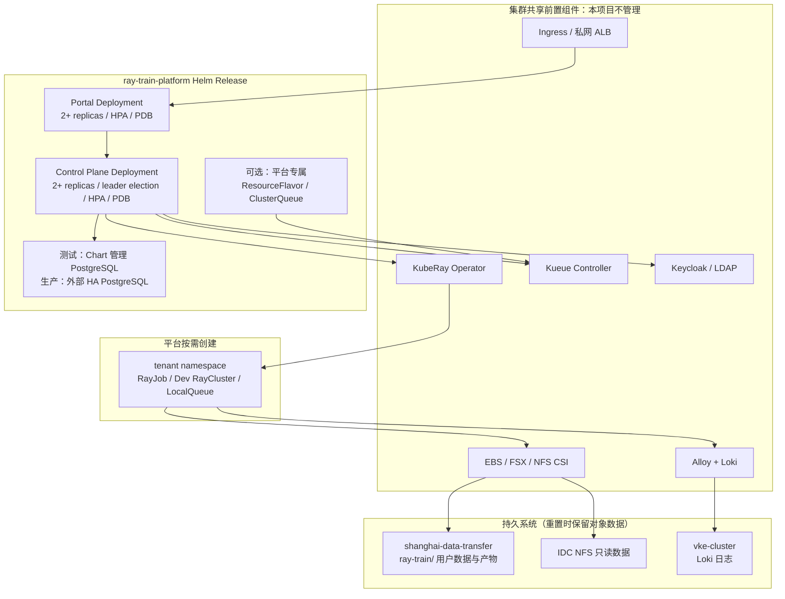

# Ray Training Platform 标准交付与重部署设计

日期：2026-08-13
状态：已确认，实施中
范围：将当前 VKE 测试项目收敛为可在任意合规 Kubernetes 集群重复部署的 Helm 交付包；本次重置仅清理训练平台自身资源，保留共享集群组件与所有 TOS 对象数据。

## 1. 目标

交付一个可审计、可重放的部署入口，而不是依赖历史 Helm revision、固定节点主机名、NodePort 或大量临时 `--set`。

- 测试环境：一台 GPU 节点即可从零部署、登录、提交单卡 RayJob、查看 Loki 日志。
- 生产环境：Portal/API 多副本、PDB、HPA、跨节点软反亲和；数据库使用外部或托管 HA PostgreSQL。
- 任意集群：KubeRay、Kueue、CSI、Ingress、日志系统为明确的前置条件，不由本 Chart 安装或卸载。
- 存储安全：训练/调试 Pod 不获得 TOS 长期密钥；受控数据空间只在 FSX CSI IRSA 前缀验收通过后打开。

## 2. 目标架构

## 3. Profile 契约

| 项 | `test` | `production` |
|---|---|---|
| Portal/API | 1 副本，无 HPA | 至少 2 副本，HPA，PDB，软反亲和 |
| 数据库 | Chart 管理的单实例 PostgreSQL + RWO PVC | 外部或托管 HA PostgreSQL，仅引用 Secret |
| 入口 | ClusterIP + 可选 Ingress | ClusterIP + 必需 Ingress / ALB |
| Kueue 资源 | 可由 Chart 创建平台专属队列 | 同上或由集群管理员预创建 |
| TOS 用户挂载 | 默认关闭 | 默认关闭，IRSA 双前缀验收后才打开 |
| 可观测性 | 引用现有 Loki；Prometheus 可选 | 引用现有 Loki、Prometheus、DCGM |

Profile 只包含非敏感配置。数据库 URL、PAT pepper、首个管理员密码、TOS 控制面凭据、镜像拉取凭据均通过预先创建的 Kubernetes Secret 注入。

## 4. 资源所有权与清理边界

### 4.1 平台可清理资源

- Helm release `ray-platform` 与 `ray-train-platform` namespace 内资源；
- 平台创建且带 `app.kubernetes.io/part-of=ray-train-platform` 或历史 `app.kubernetes.io/managed-by=ray-train-platform` 标签的租户 namespace、LocalQueue、RayJob、RayCluster、PV/PVC；
- 显式确认且无外部引用的历史平台 ClusterQueue/ResourceFlavor。

### 4.2 永不由平台重置脚本清理的资源

- VKE、节点、KubeRay、Kueue Controller、任何 CSI、Ingress Controller、Keycloak、Loki、Alloy、Prometheus/DCGM；
- `shanghai-data-transfer` 与 `vke-cluster` 中的任何对象或前缀；
- 不带平台标签的 namespace、PV/PVC、Queue、Secret；
- 外部 PostgreSQL 实例。

清理命令必须先运行预览；只有同时给出 `--execute` 和确认短语才会删除。删除数据库 PVC 只会清空平台元数据，不会触碰 TOS 对象。

## 5. 标准部署流程

1. `preflight` 检查 Kubernetes 版本、KubeRay CRD、Kueue API、GPU 节点、CSI、Ingress、共享 Loki、所需 Secret 与 Profile 渲染。
2. 可选 `reset --preview` 显示精确删除目标；经确认执行 `reset --execute`。
3. `bootstrap-secrets` 只创建或校验命名 Secret，不输出任何敏感值。
4. `deploy` 使用单一 Profile 进行 `helm upgrade --install --atomic --wait`，并记录镜像 tag/digest 与 release revision。
5. `verify` 检查迁移、Deployment、HPA/PDB、Ingress、认证边界、Kueue 与单卡任务。

## 6. 可用性与恢复

- API 的任务协调使用 Kubernetes Lease，因此可多副本运行，只有一个有效控制器；其余副本仍提供 Portal API。
- 生产 PDB 保障任意单节点维护期间前后端至少一个副本存活；HPA 根据 CPU 扩容，跨节点软反亲和降低同机失效风险。
- 平台无状态；状态落外部 HA PostgreSQL。测试内置数据库明确不是 HA，不承诺节点故障自动恢复。
- Helm 发布使用 `--atomic`；失败自动回退 workload。API 启动时在 PostgreSQL advisory lock 下执行只增迁移，不使用会先于 Chart 内置 PostgreSQL 运行的 Helm pre-install hook；数据库级回滚需独立备份/恢复流程。

## 7. 验收标准

1. 同一 Profile 可在空 namespace 用一条部署命令安装；不依赖历史 release values。
2. 清理预览不能列出任何共享组件或 TOS 对象；执行后可重新安装。
3. 测试 Profile 完成登录、任务提交、Kueue 准入、GPU 计算、Loki 查询和资源回收。
4. 生产 Profile 渲染为 API/Portal 双副本、PDB、HPA、外部数据库引用和 ClusterIP 服务。
5. 未通过 `41-verify-irsa-prefix-mount.sh` 时，`dataSpaces.enabled=true` 被部署前检查拒绝。
