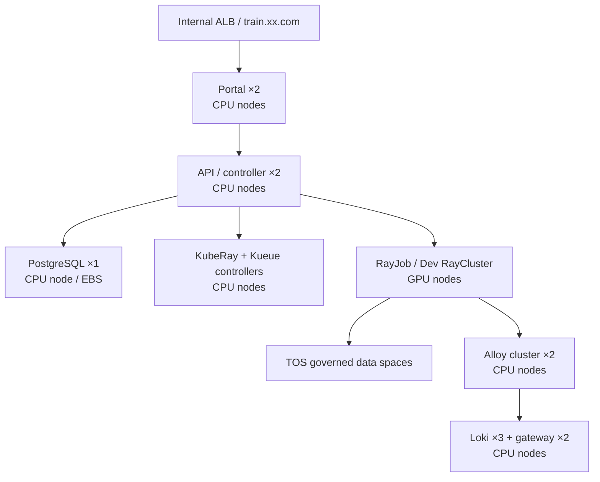

# CPU 控制面高可用与 VCI 退役设计

## 目标

将 Ray 训练平台、Loki、Alloy 以及当前位于 VCI 的可迁移控制器迁移到三台 CPU 节点（`172.28.2.65`、`172.28.2.66`、`172.28.2.67`），在不影响既有 RayJob 与调试环境的前提下，为 VCI 下线建立可验证的前置条件。

Portal 品牌同步调整为 `Ray Training Platform`，并移除登录页和应用侧边栏的副标题。

## 已确认约束

- 三台 CPU 节点均位于 `cn-shanghai-a`。本次交付提供节点级高可用，不承诺可用区级容灾。
- GPU 节点仅运行 Ray 训练/调试与 GPU 节点级监控；控制面和可观测性组件不得调度到 GPU 节点或 VCI。
- PostgreSQL 保持 Chart 内置单实例、EBS RWO 数据卷。它是已知单点，不纳入本次 HA 目标；后续可通过外部 HA PostgreSQL 替换。
- Alloy 保持 Kubernetes API 发现模式的两副本集群部署，而非 DaemonSet。它采集所有 Pod 日志；GPU 指标继续由节点上的 DCGM Exporter 采集。
- Loki 已将长期对象存储指向 TOS，配置了 `replication_factor: 3` 和 `flush_on_shutdown: true`；三个 50Gi EBS PVC 承载 WAL/本地状态。旧卷分别位于 a/b/c 区、CPU 节点仅在 a 区，且集群没有 VolumeSnapshotClass，不能对原 StatefulSet 做跨区卷重挂载。迁移采用蓝绿方式：旧 `loki` 优雅停止并保留其 StatefulSet/PVC，新的 `loki-cpu` 使用 a 区新 PVC 从同一 TOS 长期存储恢复查询；历史日志保持可查，切换窗口只可能丢失尚未送达 Loki 的极短暂在途日志。

## 目标架构

## 调度与可用性策略

1. 为三台 CPU 节点添加不可变的逻辑池标签：`platform.wellspiking.ai/pool=control-plane`。
2. Portal、API、PostgreSQL、Loki、Loki Gateway、Alloy、KubeRay、Kueue 均使用该标签；Ray 工作负载继续仅匹配 `accelerator=nvidia-rtx-4090`。
3. Portal/API 使用两个初始副本、`minAvailable: 1` PDB、主机级 `required` 反亲和和 `DoNotSchedule` 主机级拓扑分散；HPA 范围为 2–6。
4. 新 `loki-cpu` 单体模式保持三副本、PDB `minAvailable: 2`、三节点主机级硬分散；Gateway 2 副本硬分散；Alloy 2 副本硬分散并保持集群模式。旧 `loki` release 在切换后保留但缩容为零，作为可回退的本地 WAL/PVC 保留点。
5. 现有 Chart 内置 PostgreSQL 添加 CPU 节点选择器，保留单副本。其故障边界在 Portal 上明确记录为已知限制。

## 迁移顺序与保护措施

1. 先为 Chart、Loki、Alloy 和控制器创建 CPU 节点 Profile，渲染测试通过后才接触集群。
2. 构建并发布仅包含品牌变更的新版 Portal 镜像；后端镜像保持已验证版本。
3. 先迁移 Portal/API 并检查 ALB、认证、任务列表、训练日志读取；已运行的 RayJob 不会被删除、重建或取消。
4. 将 PostgreSQL 重调度到 CPU 节点。此步骤允许一次短暂的控制面数据库连接中断；训练 Pod 不受影响。
5. 优雅停止旧 Loki 并保留其 PVC；安装新 `loki-cpu` release 到 CPU 节点。等待 `/ready`、历史日志查询和 Alloy 写入均健康后，再切换 Portal API 的 Loki Gateway 地址。旧 PVC 在本次交付中不得删除。
6. 迁移 Loki Gateway、Alloy、KubeRay 和 Kueue；对 VKE 托管组件（CoreDNS、CSI 控制器、metrics-server、snapshot-controller、APIG controller）采用节点排空前的滚动重启与就绪验证，而不是删除资源。
7. 对每个 VCI 节点执行“禁止新调度 → 驱逐可迁移工作负载 → 核验无业务 Pod”流程。三节点全部无平台、可观测性和关键控制器工作负载后，才向管理员发出 VCI 下线通知。

## 验收标准

- Portal 与 API 各有至少两条 Ready 副本，且分布在不同 CPU 主机。
- Portal、API、Loki、Loki Gateway、Alloy、KubeRay、Kueue 均不位于 `virtual-node` 或 GPU 节点。
- Loki 三副本、Gateway 两副本、Alloy 两副本全部 Ready；可从 Portal 查询训练日志，Alloy 可持续写入 Loki。
- PostgreSQL 在 CPU 节点运行且数据与用户/任务记录完整。
- 训练任务提交、调试环境启动、日志查询、TOS 数据空间浏览与上传均通过回归验证。
- VCI 上不存在平台、可观测性或关键控制器工作负载；所有 VCI 节点可安全下线。

## 非目标

- 本次不提供 PostgreSQL 高可用、跨可用区容灾或训练任务跨区容灾。
- 本次不将 Alloy 改为 DaemonSet；不采集宿主机文件日志。
- 本次不删除现有 Loki/PG 数据卷，也不修改用户的 TOS 数据。
