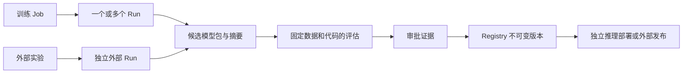

# MLflow 对外接入与模型生命周期详细设计

日期：2026-09-12。本文是后续建设的实施规格，不是已上线能力清单。当前线上事实见 [发布记录](../../QUOTA_MLFLOW_VALIDATION_20260912.md)，现有可调用合同见 [对接说明](../../MLFLOW_INTEGRATION_API.md)。本轮重新核对后端四端 `9105a47`、Helm 212、两个副本使用已发布摘要；未修改调度或用户数据。

## 1. 产品目标与现状

用户从一次训练追溯到实验指标、产物、评估证据和实际发布的模型；外部程序通过同样的资源权限完成读写。平台负责身份、团队、授权和流程，MLflow 负责实验与模型元数据，存储服务负责文件，调度层负责明确提交的评估或推理资源。

| 能力 | 当前可用 | 后续交付目标 |
| --- | --- | --- |
| Tracking | 可信 Run 列表、参数/指标、精确 Run API、已有 RUNNING Run 写入 | 实验/Run 创建、分页搜索、完整指标历史、受控 SDK 接入 |
| Artifact | 本人训练产物浏览/受限 checkpoint 下载；原生 MLflow 是另一存储面 | 显式上传或发布文件、校验摘要、按 Run/模型授权下载 |
| Registry | 原生 MLflow 管理入口；不代表平台完成模型审批 | 候选模型包、版本、来源、审批和受控别名 |
| Evaluation | 已上报指标比较，缺失保持未知 | 固定数据、模型和代码的独立评估、报告、准入规则 |
| Serving | 无平台一键部署闭环 | 独立推理部署、健康检查、鉴权、灰度和回滚 |
| UI | 实验中心、Job/Run 关联、原生详情 | 在现有实验中心内增加模型、评估、发布和接入子页 |

“我的 GPU 配额”仍在训练任务列表，实验相关能力放在现有“实验中心”，不为六个技术名词各增加一级菜单。已有 11 个分布式计算菜单保持原职责。

## 2. 信息架构与用户路径

实验中心采用五个页签：

1. **实验记录**：实验筛选、Run 搜索、Job/Run ID、状态、时间、代码/数据版本、参数与指标。Run 详情含概览、曲线、文件、关联模型、审计。比较选择 2–4 Run，展示数据版本与评测协议差异，不自动以某个 loss 判断最佳模型。
2. **模型版本**：模型名称、团队、候选包摘要、版本、来源 Run、评估结果、审批和当前别名。未登记模型时解释所缺信息，并从已完成 Run/本人产物开始创建候选。
3. **评估任务**：模型候选、固定数据集版本、评估代码版本、指标合同、资源申请、排队/执行/失败状态及报告。训练成功与评估通过分别显示。
4. **发布与服务**：审批记录、Registry 版本、外部发布状态、实际推理版本、健康与回滚入口。Registry 别名改变不等于推理 Deployment 已更新。
5. **API 接入**：当前身份/团队、已开放接口、只读/读写用途、请求示例、OpenAPI 下载、版本兼容矩阵、错误码与限额。页面不展示内部 MLflow 地址、数据库或存储凭据。

读取详情不触发任何写入；创建评估、发布模型和启动服务分别是明确操作。失败显示平台业务错误和 request_id。不可用能力显示原因及所缺条件，不能出现可点但没有后端闭环的“发布成功”。

## 3. 资源模型与归属

Job ID 是调度资源标识，Run ID 是 MLflow 记录标识；必须保存关联，不能强制相等。外部实验没有平台训练 Job 时，不伪造训练记录，也不能因上传标签就冒认已有 Job。

拟新增平台记录（名称为设计约定，迁移尚未编写）：

| 表/实体 | 关键字段与约束 |
| --- | --- |
| mlflow_experiments | id、tenant_id、owner_id、上游 experiment_id、display_name、visibility、state；团队内唯一逻辑名 |
| mlflow_runs | id、上游 run_id 唯一、experiment_id、tenant_id、owner_id、origin(training/external/evaluation)、可空 job_id、lifecycle_controller、created_by；权威归属在平台 DB |
| mlflow_artifacts | id、run_id/候选包、逻辑相对路径、对象版本、SHA-256、大小、状态、上传者；完成后不可原地覆盖 |
| model_candidates | id、tenant_id、owner_id、source_run_id、manifest_digest、MLmodel/signature/依赖/代码/数据版本、状态；固定包内容 |
| evaluations | id、candidate_digest、dataset_version、code_digest、metric_contract_version、resource_request、job_ref、状态、report_digest |
| model_approvals | candidate_digest、evaluation_report_digest、policy_version、申请者、审批者、决定/理由/时间；证据不可覆盖 |
| model_releases | candidate_digest、目标模型名、Registry version、alias、目标系统、状态、上游回执、expected_previous_version |
| integration_operations/outbox | tenant_id、principal_id、操作类型、idempotency_key、request_hash、状态、上游资源ID、attempt/next_attempt、错误类别；作用域内唯一幂等键 |
| inference_deployments | release_id、固定模型摘要、环境镜像摘要、namespace、资源额度、replicas、实际revision、health、previous_revision |

平台 DB 是授权权威；MLflow 标签用于追溯与互操作，不允许客户端改写系统标签。历史 Run 保留现有 Job+实验+provenance 校验读取，不自动批量回填、改名或迁移个人文件。新建资源才进入新归属表；历史导入需显式选择和可重复审计。

## 4. 访问控制

现有 PAT `jobs:read`、`mlflow:write` 行为保持不变。当前写入口仍限当前团队本人任务已有 RUNNING Run，管理员不能代写。本设计不把旧 PAT 自动升级为新的权限集合。

未来通过独立集成身份提供长期机器接入：管理员创建团队内 service principal，授予明确实验/模型资源 grant，设置过期和可撤销凭据；不能共享管理员 PAT 或把某人的 PAT 当作无期限公共机器账号。

| 角色/主体 | 可做操作 | 不能隐式获得 |
| --- | --- | --- |
| 资源所有者 | 在 scope 与有效 membership 内管理本人实验、创建候选、申请评估/发布 | 他人个人文件、生产审批 |
| 团队查看者 | 读取明确共享实验/模型元数据与获准文件 | 实验写入、下载所有个人文件 |
| 团队管理员 | 管理成员与资源授权、审计 | 自动读取个人文件、绕过写入/审批控制 |
| 集成身份 | grant ∩ scope ∩ 当前有效团队许可内调用 API | 自动继承创建者全部权限 |
| 审批者/发布执行器 | 对满足规则的固定候选审批；执行器仅执行已审批操作 | 改写候选文件或评估证据 |

拟新增细粒度 scope：`experiments:read/write`、`artifacts:read/write`、`models:read/write`、`evaluations:read/write`、`releases:read/request/approve`、`serving:read/deploy`。它们属于后续 API，当前令牌创建器不接受这些值。系统授权检查先找平台记录，再检查租户/owner/grant，最后访问上游；停用团队成员或集成身份立即撤销后续请求。

模型包被明确发布为团队模型时，只复制经选择的文件到独立发布前缀；原个人目录不移动、不删除。共享动作的范围是候选包，不是整个 workspace。

## 5. REST 与官方 SDK 兼容策略

现有 `/api/v1/jobs/{job_id}/mlflow/runs/{run_id}` 和 `/log-batch` 原样保留。新增 REST 资源规划如下，均为**拟实现**，不能发给对接方声称已可调用：

| 方法/路径草案 | 用途与前置条件 |
| --- | --- |
| GET /api/v1/mlflow/capabilities | 当前身份可用能力、限制、服务协议版本；不能仅返回硬编码 enabled |
| GET/POST /api/v1/mlflow/experiments | 有界分页查询/显式创建；强制平台归属 |
| GET/POST /api/v1/mlflow/experiments/{id}/runs | 分页查询/创建外部 Run；Idempotency-Key 必填 |
| GET /api/v1/mlflow/runs/{id} | 按 Run 定位平台归属后精确读取 |
| POST /api/v1/mlflow/runs/{id}/log-batch | 外部 Run 写入；沿用校验、审计与部分成功语义 |
| POST /api/v1/mlflow/runs/{id}/finish | 只结束该调用方控制的外部 Run；不改变训练 Job |
| GET /api/v1/mlflow/runs/{id}/metrics/{key}/history | 带签名游标的有界历史；完整数据导出用异步导出作业 |
| POST /api/v1/mlflow/runs/{id}/artifact-uploads | 创建限额上传会话，声明路径/大小/摘要 |
| PUT /api/v1/mlflow/artifact-uploads/{id}/parts/{n} | 幂等分块；服务端决定存储位置 |
| POST /api/v1/mlflow/artifact-uploads/{id}/complete | 验证分片、总大小和摘要后成为可见文件 |
| GET /api/v1/mlflow/artifacts/{id}/content | 重新鉴权后流式下载，不返回桶/PVC/内部URI |
| GET/POST /api/v1/model-candidates | 查询或从显式文件清单创建不可变候选包 |
| GET/POST /api/v1/evaluations | 查询或明确提交评估；校验资源额度和固定版本 |
| POST /api/v1/model-candidates/{id}/approval-requests | 绑定候选、评估报告和策略版本 |
| POST /api/v1/model-approvals/{id}/decisions | 审批者独立身份、理由、版本并发检查 |
| GET/POST /api/v1/model-releases | 发起/读取已审批模型登记或外部发布 |
| GET/POST /api/v1/inference-deployments | 查看/明确部署固定模型版本，独立资源预算 |
| POST /api/v1/inference-deployments/{id}/rollback | 回到已记录健康版本，不改训练资源 |

SDK 兼容入口建议独立前缀 `/mlflow-api/`，这里只是建议，未配置 Ingress。它返回 MLflow 原生协议响应，平台 REST 保持现有 success/data/error 信封。两套协议共享同一服务层和授权逻辑；不做任意路径反向代理。

SDK 每个端点必须列白名单，覆盖实验查找/创建、Run 创建/获取/搜索、日志批次、终态更新、指标历史、Artifact list/upload/download、Model Registry/Logged Model 对应操作。`mlflow.log_model()` 在 MLflow 3 中涉及 Logged Model 资源，不能仅支持 runs/log-batch 就宣称兼容。模型别名的生产提升必须经过平台审批，不能被 SDK 或原生 UI 旁路覆盖。

兼容目标固定到经过测试的客户端版本；首先以线上 MLflow 3.14.0 实际镜像与相同客户端验证，然后逐版本扩展。不以最新官网新增功能推断旧版可用。创建 Run 必须由服务端写入平台归属；训练控制的 Run 禁止外部 finish/delete。搜索只查已授权实验并逐项检查平台归属，不能全局查询后截断过滤导致分页遗漏或泄露。

SDK `MLFLOW_TRACKING_TOKEN` 可承载 Bearer 凭据，但当前平台地址尚不是兼容 Tracking URI。未来 Artifact URI 必须仍经同一受控入口解析，禁止把文件系统路径、原生服务地址或对象存储密钥返回给客户端。原生 MLflow Dashboard 当前是共享管理入口；在 Registry 审批上线前，必须同步解决原生写路径对受管模型和生产别名的旁路问题，否则不能声称审批强制有效。

## 6. 状态、幂等与一致性

- 外部 Run：CREATING → RUNNING → FINISHED/FAILED/KILLED；终态不自动重开。训练 Run 生命周期由训练埋点控制；外部集成不结束它。
- 文件：UPLOADING → VERIFYING → READY，失败为 FAILED/EXPIRED；只有 READY 可引用到候选包。
- 候选：DRAFT → VALIDATING → READY/INVALID；候选内容变化产生新摘要和新候选。
- 评估：QUEUED → RUNNING → SUCCEEDED/FAILED/CANCELLED。进程成功后还需验证报告完整、指标类型与候选/数据/代码摘要匹配，才能标记评估通过。
- 发布：REQUESTED → APPROVED/REJECTED → PUBLISHING → PUBLISHED/FAILED/UNKNOWN。UNKNOWN 必须按已知上游资源标识查询确认，不能盲重放创建版本。
- 推理：REQUESTED → PROVISIONING → READY/FAILED → DRAINING/STOPPED；健康检查失败不提升流量。

新增创建/发布操作使用 `(tenant, principal, operation, Idempotency-Key)` 唯一约束；同键同请求返回同资源，不同请求返回 409。平台事务先写操作与 outbox，再由 worker 调用 MLflow/外部仓；不在一个数据库事务里等待远端 HTTP。上游成功但本地落库失败时，按操作标识和回执对账，禁止重复发布新版本。

现有 log-batch 保持“可能部分生效”，不宣称 exactly-once。指标重试保留 key/value/step/timestamp；参数不可覆盖。未来幂等账本也不能将 MLflow 批量写变成跨系统原子事务，需逐项对账与明确的不确定状态。

游标绑定用户/团队、查询条件和排序；限制过期时间、页面大小和单请求资源消耗。权限变化后旧游标不能恢复旧访问权。审计记录主体、资源、操作、请求ID、结果，不记录 PAT 和任意参数值。

## 7. Artifact 与模型包

上传限制总大小、分片数量/大小、并发和团队存储额度。拒绝绝对路径、`..`、重复规范化路径和链接逃逸；归档解包需限制展开大小与文件数，不跟随符号链接。文件内容经摘要验证后进入不可变前缀，不允许客户端选择 bucket、PVC、根路径或任意下载 URL。

模型候选必须声明：源 Run、模型格式、所有文件 SHA-256/size、MLmodel、输入输出 signature、依赖锁定、代码 commit、训练数据版本、模型用途。任意 checkpoint 不自动视为 MLflow Model。候选校验先静态解析，不在控制面反序列化 pickle、不导入用户 Python；可执行校验放入隔离 worker，挂载候选只读、无控制面凭据、受限网络。

训练产物与 MLflow Artifact 不做隐式双向同步。用户选择明确文件清单后复制发布，记录原始来源和新摘要；原个人文件仍由本人持有。大文件下载与上传均流式处理，客户端关闭连接及时释放资源。

## 8. 评估、审批与发布

评估请求固定候选摘要、版本化数据集、评估代码/镜像摘要、metric contract 与资源规格。首批提供明确评估模板（例如检测 mAP/NDS、分类 accuracy/F1），不对任意模型猜测评估方式。基线比较要求相同数据与协议；报告同时给出样本量、缺失项、阈值和逐项结论。

评估作为独立资源进入现有配额与队列，默认不启动；每次提交由用户明确操作，不能借“完善 MLflow”占用当前训练卡或开启抢占。无需 GPU 的校验走 CPU worker，GPU 评估仍计入当前团队额度。

审批必须绑定不可变候选与评估报告；申请者不得审批自己的生产发布。修改模型、报告或策略后旧审批失效。Registry 版本和别名更新记录 expected_previous_version，发生并发提升则 409，不能最后写入覆盖他人发布。外部模型仓使用目标连接器、服务端凭据引用、outbox、幂等键和状态回调，回调验证签名及重放时间窗。

回滚仅将流量或别名指回经过验证的旧版本；保留新版本与审计，不能删除报告来假装发布未发生。若原生 UI 仍可无审批改生产别名，则此阶段不得验收通过。

## 9. Serving

Serving 与训练分开部署，资源预算、namespace/网络策略、服务身份、日志、超时、并发限制、readiness/liveness 和停止流程均独立。使用固定模型与环境镜像摘要，启动时校验包摘要，不把代码打进训练镜像。仅允许已审核运行时/模型格式；不把任意 pyfunc 文件直接加载进后端进程。

先提供平台内受鉴权端点，再做小流量灰度。记录部署版本与 Registry 别名解析时的确切版本；别名变化不自动触发不可审阅部署。未配置运行时、网络或额度时返回明确不可用原因，不能创建半完成资源后显示成功。

## 10. 实施顺序与验收闸门

| 阶段 | 交付 | 验收标准 |
| --- | --- | --- |
| A：现有接口交付 | OpenAPI、无依赖 Python REST 示例、错误/重试/权限合同 | 在构建机测正常读写、跨源重定向拒绝、令牌脱敏、不盲重试；对接方获准身份在专门测试目标联调 |
| B：实验与 SDK | 新归属表、外部 Run 创建/分页、SDK 白名单、接入页 | 真实 3.14 服务测试 SDK 工作流、多团队越权、撤销、幂等创建；旧 CLI/UI/训练不变 |
| C：文件与候选 | 分块上传、下载、摘要验证、模型包校验 | 大文件恢复、路径逃逸/压缩炸弹拒绝、无个人数据迁移、断连与重复 complete |
| D：评估与 Registry | 固定评估、审批、模型版本与别名、原生旁路治理 | 审批不可绕过、不同候选审批失效、重复发布不重复版本、失败对账与回滚 |
| E：Serving/外部仓 | 独立部署与连接器 | 获准资源下健康/灰度/失败回滚、凭据隔离、训练 UID/重启数不变 |

每阶段分别记录“代码实现、配置启用、真实验收”。所有代码本机编辑审阅、测试编译在构建机。新增迁移需新装/重复升级/旧数据兼容测试及可恢复数据库备份；仅 Helm values 不能替代数据库备份。控制面先验候选再四端同步；Portal 使用独立 dev，不能用本仓库旧 frontend。

本设计完成不表示 B–E 已实现或获得创建服务账号、提交评估、启动推理/改变调度的授权。必须按具体阶段实际实现和验证，再在既有授权范围内发布；真实用户数据和运行训练保持原状。

## 11. 上游参考

以下官方资料用于协议和架构参考；最新页面可能包含 3.14.0 之后新增能力，验收仍以固定镜像和客户端版本为准。

- [MLflow Tracking Server：Bearer token、Artifact 代理与存储权限](https://mlflow.org/docs/latest/self-hosting/architecture/tracking-server/)
- [Model Registry：模型版本、别名与工作流](https://www.mlflow.org/docs/latest/ml/model-registry/workflow/)
- [Tracking API：Run 与 Logged Model](https://mlflow.org/docs/latest/ml/tracking/tracking-api)
