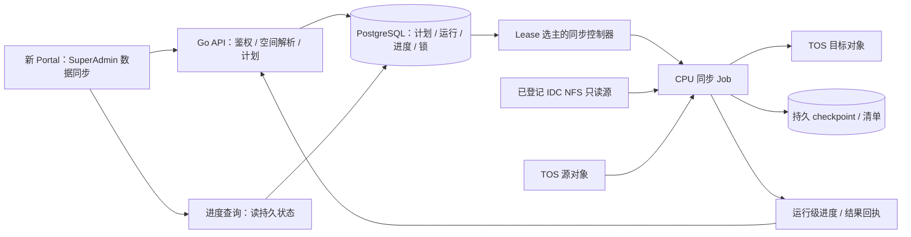

# 超级管理员数据同步：IDC → TOS / TOS → TOS

设计日期：2026-09-30；实施状态更新：2026-10-01。用户已要求实施并授权构建机测试及 guofeng.su 个人空间验收。业务源码、隔离回归、镜像构建及真实 TOS 验收已通过，尚未发布或启用。

实施计划：[2026-10-01 管理员数据同步](../plans/2026-10-01-admin-storage-sync.md)。当前使用合同、版本、验收证据及实现限制见[数据同步运行手册](../../STORAGE_SYNC_RUNBOOK.md)。下文“已核对的现状”保留 9 月 30 日设计基线，不代表当前生产状态；不得把设计目标或模拟测试当作线上验收。

## 1. 目标与已确认范围

把近期四个 IDC `nusc/` 目录上传，以及从旧 TOS 目录补齐 `maps/expansion/cnwxijk.json` 的操作，做成新 Portal 中可重复使用的管理功能。管理员选源、选目标、预览落盘路径，手动或定时执行，查看进度，失败后继续。

用户已确认首期同时支持 **IDC → TOS、TOS → TOS**，且只允许超级管理员操作。支持文件与目录、多条映射、全量、增量、断点恢复、定时、历史记录。数据限于平台现有受控存储。

建议默认规则：

- 只复制和按策略更新，保留目标端额外文件；不传播源端删除。
- 默认增量；全量明确表示重传本次源清单中的全部文件，不表示清空目标。
- 目标首期覆盖公共空间、指定团队的共享空间；个人空间仅允许操作者本人已有的授权范围。不会因 SuperAdmin 身份自动获得其他用户个人文件访问权。
- IDC 源始终只读；同步任务不申请 GPU。普通用户训练提交方式及挂载路径不变。
- 新功能不自动接管、重跑或修改此前的四目录同步；可按原映射登记计划，预检后再启动。

## 2. 已核对的现状

本轮以本地后端 `main@12cdc31` 和可读取的新 Portal clone 为源码依据；没有把源码状态当作线上部署状态，也没有访问生产集群验证配置。

| 能力 | 当前实现与边界 | 本次需要补齐 |
| --- | --- | --- |
| 管理鉴权 | `backend/api/idc_sync_admin.go`；交互会话且 SuperAdmin | 所有新增浏览、预检、控制及结果接口均使用同等后端校验 |
| IDC 同步模型 | `backend/domain/idc_sync.go`、迁移 0039；固定 `idc-original` | 多个登记 IDC 源、TOS 源和逻辑目标空间 |
| 执行调度 | `backend/idcsync/manager.go`；定时间隔、单 connector 活跃 run、Kubernetes Lease | 通用计划、运行快照、恢复、目标前缀冲突管理 |
| Worker | `images/idc-sync/idc_sync/worker.py`；mirror、raw blob、inventory | 直接目录复制、逐文件结果和阶段进度 |
| Job | `backend/k8s/idc_sync_job.go`；只读 NFS、work PVC、Secret | CPU/内存/带宽限制、取消与恢复完整生命周期 |
| TOS 浏览 | `backend/api/data_spaces.go`、`storage_assets.go` | 管理员显式选择目标团队后的受控解析 |
| IDC 浏览 | 现有 IDC 空间不可网页枚举 | 专用管理接口和只读目录探测，保持普通用户接口原契约 |
| 新 Portal | `QuotaManage/index.vue` 已有 SuperAdmin-only 的 `IDCDataSyncPanel.vue` | 通用数据同步页、预览、进度、恢复及调度配置 |

新 Portal 本次只读定位的 clone：`/Users/ashersu/Desktop/西井/wellspiking-frontend-diagnostics-20260929`，当前是历史诊断工作分支，不能直接视为待发布 dev 基线。实施前需重新核对正式新 Portal `dev` 及并行改动。本仓库 `frontend/` 是旧前端，不在本次改造范围。

现有 IDC 同步会生成内容寻址 raw 对象和不可变 inventory，供数据集发布器使用。本次直接向公共/团队目录复制的行为不应冒充不可变数据集发布。

## 3. 方案比较与建议

| 方案 | 优点 | 代价/边界 |
| --- | --- | --- |
| 给构建机脚本加页面 | 最快复用近期脚本 | 绑定单机构建机，权限、调度、恢复及状态可靠性不足 |
| 扩展既有 IDC connector | 可以沿用现有表和入口 | original-only、mirror/raw/inventory 与可选目录复制混合，影响数据集发布契约 |
| **新增通用同步领域，复用平台基础设施（建议）** | 清楚支持两种方向；保留现有发布链路；可独立验收 | 新增模型、Worker、API、页面和迁移，工作量大于包装命令 |

建议新增 `storage-sync` 模块，借鉴现有 controller、Job、回调、目录授权实现，避免直接改写旧 IDC 表的语义。可复用通用函数和组件，不要求先大规模抽象重构旧模块。

## 4. 管理员使用流程

新前端入口：**平台管理 → 数据同步**。沿用现有 SuperAdmin 管理区域，将原 IDC 同步功能保留为“原始数据接入/数据集发布”子页，通用同步作为主要子页，不额外要求普通用户增加菜单角色。

1. 新建同步计划，填写名称。
2. 选择源空间：已登记的 IDC `.spk-hybrid`、`.original` 等，或授权的 TOS 公共/团队/本人空间。
3. 浏览或粘贴源路径。客户端可以接受用户熟悉的 `/mnt/.spk-hybrid/...`、`/.spk-hybrid/...` 别名，最终由服务端转换为登记的空间 ID + 相对路径。未知根路径拒绝执行。
4. 选择目标空间、目标团队（如适用）及目录；支持在受控根下指定新目录。
5. 每条映射显示最终用户路径。目录复制明确选择“复制目录内容”或“保留目录名”，默认保留目录名。多条映射产生同一目标文件时预检报冲突，不静默合并。
6. 选择全量/增量、同名策略、时间计划和限速；预检展示新增、待更新、复用、冲突、源端消失、目标额外对象及本次待传容量。
7. “保存计划”只保存；“立即同步”创建运行；启用定时后由后台触发。关闭浏览器不影响后台执行。
8. 查看每条映射及整体进度、失败文件、历史记录；复制训练环境可用的目标路径。

列表字段：名称、方向、源/目标摘要、调度与下次执行、当前阶段、最近结果、操作。详情显示路径映射、计数、字节、速度、预计剩余时间（无法估算时为空）、最后心跳、失败原因和文件明细。无需在产品界面展示 Secret/PVC、命令行参数、AK/SK。

### 4.1 此次四目录对应示例

源空间：IDC `.spk-hybrid`；目标空间：公共空间。每条映射复制 `nusc/` 本身：

| 源相对路径 | 最终用户路径 |
| --- | --- |
| `extract/0c9b53cd344943298edc75c81a47651b/nusc/` | `/mnt/storage/public/maptr_data/data/jinke/58/0c9b53cd344943298edc75c81a47651b/nusc/` |
| `extract/4f7635794d484c6d80495a2422b017e7/nusc/` | `/mnt/storage/public/maptr_data/data/jinke/58/4f7635794d484c6d80495a2422b017e7/nusc/` |
| `extract/ffeb01109b7349aa8ed2e0c6581226ca/nusc/` | `/mnt/storage/public/maptr_data/data/jinke/58/ffeb01109b7349aa8ed2e0c6581226ca/nusc/` |
| `extract/0aaa1e56d62346adb3f8a8f05a6471b3/nusc/` | `/mnt/storage/public/maptr_data/data/jinke/58/0aaa1e56d62346adb3f8a8f05a6471b3/nusc/` |

TOS → TOS 补文件可以是一条源文件到四条目标文件映射。上述四个目标端新增的 `maps/expansion/cnwxijk.json` 不在 IDC 源中，后续增量必须保留。

## 5. 全量、增量、恢复与校验的准确含义

| 操作 | 语义 |
| --- | --- |
| 全量复制 | 按本次冻结的源文件清单重新复制全部对象，按已选同名策略处理；不删除目标额外对象 |
| 增量同步 | 对比上次成功基线、当前源指纹与目标状态，传新增/变化/缺失/损坏对象；首次没有基线时建立完整基线 |
| 恢复运行 | 使用同一 run 的路径快照、文件清单和 checkpoint，复核已完成对象、源指纹及有效分片后继续未完成工作 |
| 全量内容校验 | 独立校验选项，读取源内容比较 checksum；与“按元数据快速增量”区分展示 |

默认同名策略为“更新源端对应的变化文件，保留目标端额外文件”；支持“遇到不同内容同名文件则失败”用于不希望覆盖的目的目录。预检明确列出覆盖范围，运行及定时均固定使用计划配置。

IDC 快速增量先使用路径、大小、纳秒修改时间及可用的文件标识筛选，变化候选重新计算内容摘要；仅凭大小不能判定一致。若源内容变化但所有比较属性保持不变，快速模式无法保证发现，页面显示校验方式，可选择全量内容校验。文件上传前后复核属性，发生变化则不得标为已校验成功。

TOS 源保存对象 key、size、ETag、LastModified、可用的 versionID/checksum。读取/复制固定版本或带源对象条件，防止扫描后源对象被替换。ETag 作为版本指纹使用，不假设所有 ETag 都是 MD5。目标同大小但版本变化仍需重校验，不能直接复用旧结果。

增量由平台清单决定待传集合，不把 `tosutil cp -u` 作为唯一正确性判断。官方说明的 `-u` 基于存在性、大小及修改时间；`-vchecksum` 对实际传输提供 CRC64 校验，不等价于重校验全部跳过文件。[官方参数说明](https://docs.volcengine.com/docs/ElasticFileStorage/BestpracticesformigratingdatabetweenNASandTOSusingtosutil?lang=en)

目录没有全局原子快照：清单固定本次文件集合，扫描后新增文件留给下次同步；单文件在传输中变化使该文件失败。目录同步期间已完成文件可以先可见；“运行成功”必须等全部计划文件按所选策略完成验证。需要训练数据不可变版本时继续使用已有数据集发布流程。

## 6. 架构与执行位置

执行器运行在可访问 IDC NFS 和 TOS 的 CPU 运维节点池；部署前实测路由、DNS、挂载和权限。不默认把构建机当长期同步服务，也不把 CPU-only 理解为自动不会落到 GPU 节点：需配置明确的节点选择和资源限制。

建议使用固定版本的 TOS Python SDK 编写新 Worker：列举、HEAD、上传/复制、分片与进度使用结构化接口；沿用现有 Python Worker 的打包/测试习惯。SDK 官方提供上传、复制及断点功能，实施时固定版本并实测能力；tosutil 保留为运维诊断工具，不通过解析终端进度条实现核心状态协议。[官方 SDK 能力](https://docs.volcengine.com/docs/TorchObjectStorage/IntroductiontoPythonSDK?lang=zh)

TOS → TOS 使用同区域服务端复制，避免先下载整份数据到本地；首期只开放既有同区域受控目标。大对象使用分片复制与 checkpoint；固定源版本或条件必须覆盖每个分片。[源对象条件](https://docs.volcengine.com/docs/TorchObjectStorage/copyobject?lang=en)、[分片复制条件](https://docs.volcengine.com/docs/TorchObjectStorage/UploadPartCopy?lang=en)

IDC 浏览走独立管理员接口，通过短生命周期的只读 CPU 探测 Job 做限定根内的一级目录枚举/路径验证，超时返回可诊断状态。结果有 TTL、分页和条数上限；大目录可用直接路径 + 预检。初期接受探测 Job 的启动延迟，不让 Go API 的请求线程直接阻塞在 NFS 遍历上，也不改变普通数据空间 `browseEnabled=false` 的契约。

## 7. 持久模型与 API 草案

新增迁移只追加，不修改旧迁移或现有 IDC connector/run 语义。具体编号实施时按最新 migration head 分配。

- `storage_sync_plans`：名称、创建者、配置 revision、启用状态、方向、映射、模式、同名策略、校验方式、调度、时区、并发/带宽上限。
- `storage_sync_runs`：plan/config revision、手动/定时触发者、不可变配置及空间解析快照、状态/阶段、累计计数、心跳、时间、结果摘要、基线/清单摘要。
- `storage_sync_attempts`：run、attempt、fencing generation、Job UID、checkpoint 引用、回执序列、失败原因。业务恢复复用 run，执行 attempt 单独留痕。
- `storage_sync_path_locks`：规范化 bucket/region/prefix、读写模式、run/attempt owner。先按存储根加事务锁，再检查路径段级重叠；`a/` 与 `a/b/` 冲突，`a/` 与 `ab/` 不冲突。
- 逐文件清单/结果存于持久工作区及私有内部对象前缀，按 run 分块并记录摘要；数据库存索引、聚合和分页定位，不每个分片写数据库。

建议新增 `/api/v1/admin/storage-sync` 下的接口：

- `GET /spaces`，`POST /browse-requests`，`GET /browse-requests/:id`：授权目录与只读探测。
- `POST /previews`，`GET /previews/:id`：异步预检、最终路径与差异；预检不写目标业务数据。
- `GET/POST /plans`，`GET/PATCH /plans/:id`：计划配置与 revision 并发控制。
- `POST /plans/:id/runs`，`GET /runs`，`GET /runs/:id`，`GET /runs/:id/files`：触发、列表、阶段进度及文件明细。
- `POST /runs/:id/pause|resume|cancel|retry`：状态受控且幂等的运行控制。

手动开始操作必须携带幂等键、`previewId`、`configRevision` 和已接受的清单摘要。预检绑定操作者、配置、空间解析、源/目标指纹和有效期，启动时再次核对；过期、身份不匹配或路径含义变化返回明确的重新预检错误，不创建有写权限的执行器。扫描与预检执行器只持有只读凭据。

定时执行每轮在 run 内生成新清单，只有预检完成、配置/解析一致且没有阻断冲突，才进入有写权限的传输阶段。每次真正写入前仍执行对应源/目标条件，预检不是取消并发保护的理由。目录无原子事务，传输开始后的冲突可以导致部分文件已完成，必须清楚报告失败范围。浏览响应仅返回逻辑路径和必要元数据；配置不接受 shell、NFS server、endpoint、凭据、PVC 或任意 bucket。错误使用现有 API envelope，包含稳定错误码和可理解的原因。

Worker 回调使用单独 internal 路由，token 绑定 run、attempt、有效期与有限操作；累计序列单调，重复请求幂等，旧 attempt 回调不能覆盖新 attempt。长任务需受控续期，不以一次短时 token 隐式限制大目录运行时长。

## 8. 调度、冲突与状态可靠性

调度首期提供手动、每 N 小时、每天指定时间、每周指定时间，时区默认 `Asia/Shanghai`，展示下次执行。高级任意 Cron 可后续增加。run 的调度槽键 `(planID, configRevision, scheduledAt)` 唯一，事务推进 nextRunAt，Lease 选主只是第一层防重。

同计划同一时间最多一个运行；上次未结束则合并过期触发，记录跳过/延迟，避免追赶历史形成任务风暴。计划关闭只停止未来调度，停止当前运行需单独操作。修改源/目标产生新 revision，新一轮重新预检和建立基线，不让旧 checkpoint 写入新目录。创建者失去 SuperAdmin 或被禁用时冻结其定时计划，等待有效 SuperAdmin 接管。

运行状态为 `QUEUED → RUNNING → SUCCEEDED/FAILED`，运行阶段为扫描、计划、传输、校验；暂停经过 `PAUSING → PAUSED`，取消经过 `CANCELLING → CANCELLED`。只有执行器全部退出、未决请求结束后才释放路径锁；若无法确认进程退出，则必须完成下述凭据隔离及请求排空门禁。单纯心跳超时先视为异常并核验 Job，不直接重开第二个写入者。节点失联时不能以强制删除 Pod API 对象作为进程已停止的证据。

新 Worker 的自动接管模式必须使用按 run/attempt 和源/目标前缀限定的短期 TOS 凭据；长期的签发身份只留在控制面。续期必须校验当前 attempt 和持锁状态，停止/失联的旧 attempt 不再续期。token 失效只阻止新的认证请求，不证明已接受请求终止：自动接管还须验证服务端请求超时/排空边界以及未完成 multipart 处理；不能证明安全则保持阻塞。API 回调 fencing 本身不能阻断 TOS 写入。

如果既有账户暂不支持此类短期凭据，兼容模式可使用已批准 Secret，但明确禁止在旧节点失联时自动接管或通过按钮强制恢复。页面显示“等待旧执行器停止”，保留路径锁，必须取得旧进程/节点已隔离且未决写入结束的证据后再恢复。普通网络重试、已确认退出的 Pod 重建、控制面重启仍可继续。两种模式都不为追求可用性提前放开并发写入，不擅自轮换共享凭据影响其他任务。

同步计划之间目标写前缀互斥；TOS 源读前缀与其他同步的写前缀也互斥，阻止流水互相覆盖。拒绝源目标相同及递归包含关系，防止把目标纳入源再次复制。多个映射在运行内同样检查重叠，多根锁按固定顺序获取以避免死锁。暂停期间保持计划的运行占位但允许在执行器确认停止后释放路径锁；恢复必须重新获取锁并复核源/目标，冲突时保持暂停并说明原因。

这类锁无法约束平台外的 TOS 客户端。写入前记录目标版本，传输适配器优先使用服务端支持的条件写入；遇到外部变更返回冲突，不悄悄解释为成功。实施必须验证小对象及分片完成的条件语义；若指定策略无法可靠实现则禁用该策略，不以 HEAD-then-write 冒充原子保护。公共目录实时复制不承诺目录级事务或原子切换。

## 9. 进度与恢复

扫描未完成时显示“已发现 X 个文件”，不伪造百分比。冻结待传清单后分别记录：源总量、待传量、复用量、传输成功量、验证通过量、失败量、目标额外文件。

传输百分比按本次待传字节计算；0 字节/0 个待传对象显示“无需传输，正在校验/已完成”。空文件以对象计数反映。映射尚未开始显示“等待中”，不能只显示一个容易误解的 0。字节统计区分有效完成量、在途量和重试网络流量，重传不让进度超过 100%。目标额外文件不计入源端总量。服务端复制按已确认分片/对象累计逻辑字节，显示复制速率，不冒充 IDC 出口实时带宽。

Worker 默认每 5 秒上报累计进度，控制面限频合并，页面读取数据库中的状态；不为刷新进度频繁递归列举整个目标桶。heartbeat 过期显示“进度暂未更新”，速度/ETA 停止估算。只有全部验证完成且最终回执持久化才显示成功，Pod exit 0 本身不够。

checkpoint 存在跨 Pod 可用的 PVC，每个 run/object 使用与源指纹、目标和配置一致的路径。失败重试与暂停恢复保留 checkpoint；恢复前检查源指纹、已完成对象和远端 multipart upload，失效分片仅重传该对象。源变化使旧清单不能继续时要求新建一轮扫描。终态失败可创建新的 attempt，历史错误保留。

暂停保留分片，取消终止运行但保留已完成目标文件；“取消”不等于回滚已复制数据。仅回收本 run 可证明归属的未完成 multipart，清理成功后不再承诺分片级恢复。操作与回收相互幂等，不能误删其他任务的分片。checkpoint 建议保留 7 天，运行摘要与审计保留 90 天，可由平台配置；页面显示可恢复期限。

控制器重启通过 run/attempt 及确定性 Job 名称接续；创建 Job 后响应丢失也不得重复执行。失联或回调丢失时，从受控结果文件恢复事实，不能简单将所有孤立 RUNNING 标成功。

## 10. 权限、路径与资源边界

- 新接口全部要求当前有效交互会话 + 后端成员记录的 SuperAdmin。Engineer、TenantAdmin、普通训练 PAT 无访问权；前端隐藏只是展示层。
- 新增只读 `AdminStorageResolver`：输入有效 SuperAdmin principal、`spaceKind`、显式 `tenantID`（团队空间必填）及相对路径，读取现有团队目录册/绑定，返回仅供后端使用的 root、存储身份、策略与 revision。校验团队存在且可用，禁止按操作者当前团队回退、伪造 principal 或初始化他人个人空间；团队根未准备好时明确返回未就绪。公共空间走平台固定配置；本人个人空间要求 owner 等于 principal subject 并使用稳定 storage home，不允许提交其他 owner。
- 源/目标空间禁用、身份被禁用、权限撤销在调度和恢复时重新校验；运行中按心跳/控制循环转受控停止，短时间内已提交的对象写入不承诺撤回。
- 路径按组件规范化；拒绝 `..`、绝对路径穿越、NUL、未知编码歧义。IDC 不跟随 symlink，逐层安全打开以避免校验后链接替换，拒绝 FIFO/设备等非普通文件；异常逐项报告，不能默默遗漏再报成功。
- 凭据由已有受控身份体系提供，自动接管模式必须满足第 8 节的短期凭据要求；静态 Secret 模式采用严格停止确认门禁。实际可签发权限必须先核对，不将 raw/inventory/平台私有内部前缀作为目标选项，不为上线擅自扩大现有凭据权限。只读探测、预检和可写传输使用不同权限范围。
- TOS 复制保留必要内容元数据，但目标 ACL、加密及访问权限遵循目标空间策略，不能继承源端更宽的共享权限；无法按目标策略落盘则失败。
- Worker 非 root、只读 rootfs、源卷只读、禁自动挂载 ServiceAccount token。控制器取消 Job 所需 RBAC 限定运行命名空间，Worker 不获得 Kubernetes 管理权限。
- CPU/内存 request/limit、临时空间、文件并发、分片并发、带宽限额必须可配置并有全局上限；起步单活跃大任务、小并发，压测后再调整。请求数量、分页、预检任务数均限流。
- 审计保存操作者、源/目标空间及逻辑路径、计划 revision、模式、触发方式、时间、运行结果；失败输出脱敏，不保存密钥或完整命令凭据。

## 11. 验收标准

先在构建机隔离目录完成测试，再用专用小规模数据前缀验收；不修改用户训练数据，也不再次传输整份 270 GB 数据作为默认测试。

| 层级 | 必须覆盖 |
| --- | --- |
| 单元 | 路径及前缀冲突、两种复制布局、配置 revision、全量/增量差异、时区和错过调度、计数/空文件/零变化、状态机 |
| PostgreSQL 集成 | 新迁移合同、计划行锁、并发触发幂等、层级前缀读写锁、旧 attempt fencing、Leader 切换与 Job 创建响应丢失 |
| API 权限 | 非 SuperAdmin 全部管理接口 403、不可凭 menu/tenantID 提权、跨用户个人路径禁止、旧回调/跨 run token 拒绝 |
| IDC Worker | NFS 未挂载/不可达、特殊文件、symlink 替换、源复制中变化、同大小但 mtime 倒退变化、分片中断恢复 |
| TOS Worker | 服务端复制、固定源版本/条件、分片复制、目标并发修改、multipart ETag 非 MD5、元数据和校验方式、SDK 限速及分页 |
| 正确性回归 | 1000+ 条目及包含空格、中文、百分号的 key；保留目标额外 JSON；无变化时 0 待传且结果正确；目标缺失/同大小变化可发现 |
| 生命周期 | 暂停/继续、取消无残留写入者、Job/后端重启、分片失效、checkpoint 到期、回调丢失、不能以进程退出代替校验成功 |
| Portal E2E | 两种方向的选择/预检/启动/进度/恢复/周期；普通用户和团队管理员无入口且 API 拒绝；输出路径与训练挂载一致 |

以下命名验收场景必须有明确断言：

1. `preview_expired_or_target_changed_before_start`：预检过期或启动前修改目标，手动请求被拒绝，未创建写执行器，目标写调用次数为 0。
2. `scheduled_preflight_conflict`：定时 run 检出路径漂移或同名阻断冲突，传输未开始，目标写调用次数为 0。
3. `partitioned_writer_still_authorized`：旧 Worker 断开控制面但仍能访问 TOS；旧凭据仍有效或请求未排空时，恢复被阻塞、锁未释放、第二个写入者为 0。静态 Secret 模式必须一直阻塞到取得停止证据。
4. `attempt_expired_and_drained`：旧 attempt 不再取得续期，验证其新写请求被 TOS 拒绝、已接受写入已排空后，才允许新 attempt；旧回调不能改变新状态。
5. `pause_stop_and_resume_lock_conflict`：暂停尚未完成时第二计划不能写；停止后可释放锁；另一计划取得锁后原计划恢复仍保持暂停，不出现两个写入者。
6. `preserve_target_only_map_json`：源无 JSON、目标有 JSON，执行全量和增量后目标 JSON 字节及摘要不变，额外文件不进入源总量/传输百分比。
7. `conditional_copy_race`：在 HEAD/预检之后、CopyObject 或分片提交之前修改源/目标，服务端条件阻断旧复制；必须覆盖已选 SDK 的分片完成路径，不能只验证客户端先 HEAD 再写。
8. `explicit_other_team_resolution`：管理员当前团队为 local、显式目标为 yolo，解析结果只能落到 yolo 团队共享根；伪造 owner/省略目标团队不得回退到其他根。

按仓库约定执行 TDD；新增可测模块覆盖率至少 80%，不能把覆盖数字代替以上边界测试。后端格式、go vet、完整 Go 回归、真实 PostgreSQL 验证；Worker 单元及受控 TOS 集成；新 Portal 的 Dockerfile.lint、合同测试及构建均在构建机完成。

近期实际结果只作为回归需求：四目录原始 135,151 个文件、约 269.97 GB，后补 4 个目标端 JSON；新的平台功能尚未通过这些验收。

## 12. 实施与交付边界

建议实施顺序：领域及持久状态/权限 → 两种 Worker 与恢复/校验 → 定时与生命周期 → 新 Portal 页面 → 故障与权限验收。每阶段写对应测试，不把进度和恢复留到不可验收的最后补丁。

真正上线涉及新增数据库迁移、后端、同步 Worker 镜像及 Job/RBAC/工作盘配置；新 Portal 改动推送 dev 后走现有 CI/CD。这与仅登记一个镜像或仅复制数据不同，不能只改前端。现有 IDC pipeline、训练 CLI 与用户挂载合同保持兼容。

设计确认只决定开发范围；本草案未执行远程测试、推送、部署、凭据变更或创建生产同步计划。发布前按 release 约定形成具体候选、测试证据和配置差异，依据届时有效授权交付。数据库迁移不能靠 Helm rollback 撤回，回滚方案优先禁用新同步入口和调度、保留审计与已完成对象。
